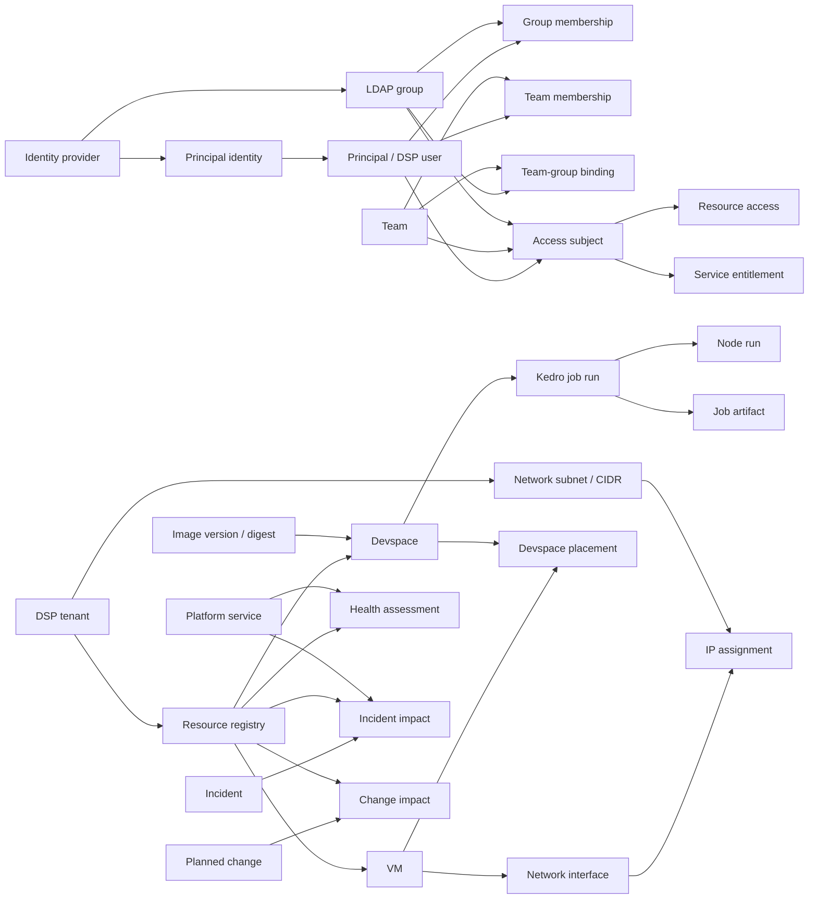

# DSP Portal Data Model

Status: Approved logical model v1

Owner: DSP Platform

Last reviewed: 2026-08-26

The DSP Portal is an operational aggregation layer. PostgreSQL owns portal identity mappings, resource inventory, relationships, execution metadata, derived health, impact mappings, and portal-owned state. LDAP, Compute, Nexus, GitHub, Remedy, Confluence, and the monitoring platform remain authoritative for their respective domains.

The renderable relational definition is maintained in [`data-model.dbml`](./data-model.dbml). Alembic migrations will become the authoritative physical schema when persistence is implemented.

## Architectural decisions

1. Use PostgreSQL for durable relational data and relationship traversal. The expected scale does not justify a separate graph database.
2. Keep Pydantic API response models separate from persistence models. Homepage, VM, devspace, and job responses are derived read models.
3. Separate resource lifecycle from health. A stopped devspace is a lifecycle state, not an unhealthy resource.
4. Represent LDAP groups and business teams independently. Explicit bindings relate groups to teams and entitlements.
5. Give every user an internal DSP principal ID and preserve external directory identifiers separately.
6. Model VM addresses through interfaces and temporal IP assignments. IP addresses are attributes, never resource identifiers.
7. Preserve temporal history for LDAP membership, team membership, access, devspace placement, and IP assignment.
8. Snapshot VM, image digest, and Git commit on every job run so historical execution context cannot change.
9. Keep high-frequency metrics and logs outside PostgreSQL. Store only operational metadata, state changes, and references.
10. Never store passwords, CyberArk credentials, service tokens, or unredacted secrets in the portal database.

## Conceptual relationships

## Domain model

### Integration and provenance

- `source_system` identifies LDAP, Compute, Podman/runtime, Nexus, GitHub, Remedy, Confluence, and monitoring integrations.
- `operational_event` provides an idempotent event envelope using `(source_system_id, external_event_id)`.
- Source-fed records carry `observed_at`; time-sensitive assessments additionally carry `valid_until`.

### Identity, LDAP, and teams

- `principal` is the internal DSP identity. Its UUID is the application user ID.
- `principal_identity` stores enterprise user ID, username, UPN, LDAP DN, and immutable directory object ID.
- `directory_group` stores LDAP/AD groups.
- `directory_group_membership` supports both user-to-group and nested group-to-group membership.
- `team` is a business/DSP concept and owns the canonical team name.
- `team_membership` relates users to teams and records whether membership came from HR, LDAP mapping, or manual administration.
- `team_group_binding` maps one or more LDAP groups to a team without treating the group as the team itself.
- `access_subject` allows a principal, team, or LDAP group to receive resource access and service entitlements.

### Tenants, resources, and access

- `dsp_tenant` represents a controlled DSP allocation: VM set, IP range, environment, and ownership boundary.
- `resource` provides stable internal IDs and external source mappings for VMs, devspaces, repositories, images, and pipelines.
- Typed extension tables contain operational fields; queryable attributes must not be placed in an EAV structure.
- `resource_access` assigns owner, contributor, viewer, or support roles to an access subject.
- `service_entitlement` records access to CDP, Trino, SAS, CyberArk, Nexus, GitHub Actions, and other platform services without storing credentials.

### VM and network inventory

- `vm` extends a resource with hostname, FQDN, host group, operating system, runtime, capacity, and patch facts.
- `network_zone` identifies controlled network/security boundaries.
- `network_subnet` stores tenant CIDRs using PostgreSQL `CIDR`.
- `network_interface` stores VM interfaces and MAC addresses.
- `ip_assignment` stores temporal primary, secondary, or NAT addresses using PostgreSQL `INET`.
- IP and CIDR fields are security-sensitive and must be filtered by authorization policy before being returned by an API.

### Devspaces and software supply chain

- `artifact_repository` represents Nexus container or Python repositories.
- `image_version` stores both the human-readable tag and immutable image digest.
- `devspace` stores runtime identity, resource limits, lifecycle timestamps, and last activity.
- `devspace_placement` preserves VM placement history and permits only one active placement per devspace.
- `devspace_service_binding` records current connectivity to platform services.

### GitHub and Kedro execution

- `git_repository`, `kedro_project`, `pipeline_definition`, and `pipeline_version` describe versioned executable code.
- `job_run` records a Kedro execution and snapshots its VM, image digest, and Git commit.
- `job_node_run` records node-level progress and failure context.
- `job_artifact` references models, datasets, reports, and metrics produced by a run.
- Local Kedro hooks should emit start, node, completion, and failure events; the portal must not run commands inside a devspace.

### Health, incidents, and changes

- `platform_service` defines Compute, CyberArk, Nexus, CDP, Trino, SAS, GitHub Actions, and other operational services.
- `health_assessment` is an append-only evaluation for either a resource or a platform service.
- `incident` stores a local reference to an externally owned incident, normally Remedy.
- `incident_impact` relates incidents to affected resources and services.
- `planned_change` and `change_impact` support personalized maintenance and release impact.

### Support, onboarding, and user continuity

- `troubleshooting_guide` and `common_issue` hold searchable guide metadata and Confluence deep links.
- `support_route` keeps service-specific Teams, Remedy, and Confluence routes.
- `support_roster_shift` identifies the current DSP or service specialist.
- `ticket_reference` stores only Remedy identifiers, state, and deep links—not a duplicate ticket body.
- Onboarding tables track programs, steps, entitlements, training, bootcamp sessions, and completion.
- `notification` and `user_notification_state` provide personalized attention and read state.

## Critical invariants

- External identity: `UNIQUE(identity_provider_id, external_object_id)`.
- Source resource: `UNIQUE(source_system_id, external_id)`.
- Event ingestion: `UNIQUE(source_system_id, external_event_id)`.
- Exactly one member target on each directory membership: principal or nested group.
- Exactly one subject target on each access subject: principal, team, or directory group.
- Exactly one health target: resource or platform service.
- Exactly one incident impact target: resource or platform service.
- At most one active VM placement for a devspace.
- At most one active primary address per VM interface/address family.
- Image digest is immutable after creation.
- Job execution snapshot fields are immutable after a run starts.
- All stored timestamps use UTC `TIMESTAMPTZ`; relative strings such as `2h ago` are generated only by the UI.
- Memory and storage use bytes, CPU uses cores or millicores, IP uses `INET`, and network ranges use `CIDR`.
- Percentages and running ages are derived, not persisted as authoritative values.

## Storage ownership

| Data | Authoritative store |
|---|---|
| Portal identity mappings, teams, inventory, relationships | PostgreSQL |
| LDAP users and groups | Enterprise directory |
| VM provisioning facts | Compute platform |
| Devspace/runtime inventory | Podman/runtime integration |
| Images and Python packages | Nexus |
| Repositories and workflows | GitHub/GitHub Actions |
| Kedro run and node metadata | PostgreSQL from Kedro events |
| CPU, memory, storage, restart metrics | Prometheus/Thanos |
| Logs | Loki/OpenSearch |
| Short-lived process snapshots | Redis or live runtime adapter |
| Tickets and incidents | Remedy |
| Documentation | Confluence |
| Large model/report artifacts | Approved enterprise artifact/object store |

## API read models

The following remain API projections rather than persistence tables:

- Homepage/DSP health
- My DSP and recent activity
- VM inventory and VM detail
- Devspace inventory and devspace detail
- Kedro job inventory and job detail
- Troubleshooting/support catalog
- Onboarding and training

FastAPI application services assemble these projections from repositories and integration clients. Existing camelCase API contracts can remain stable while static preview services are replaced incrementally.

## Physical implementation sequence

1. Source systems, identity providers, principals, LDAP groups, memberships.
2. Teams, access subjects, DSP tenants, resource access, service entitlements.
3. Resource registry, VM inventory, network zones, interfaces, IP assignments.
4. Nexus repositories, image versions, devspaces, placements, service bindings.
5. Git repositories, Kedro projects, pipelines, job runs, nodes, artifacts.
6. Platform health, incidents, planned changes, and impact mappings.
7. Support, onboarding, operational events, and notifications.

SQLAlchemy persistence models should live separately from Pydantic API schemas, and every physical change must be delivered through an Alembic migration.
