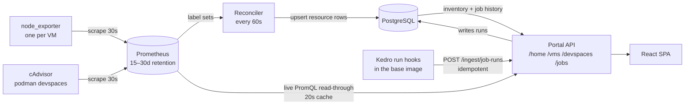

# DSP Portal — Phase One: Prometheus to portal

| Field | Value |
| --- | --- |
| Status | Draft for review |
| Scope | Showing VM, devspace and Kedro job state from data already in Prometheus |
| Last updated | 2026-09-07 |

## 1. The load-bearing insight

**Prometheus gives you metrics and, for free, an inventory. It cannot give you job runs.**

Node and container label sets already describe every VM and devspace we own, so reconciling them
into PostgreSQL yields a live inventory with no CMDB integration. Kedro runs are events: they need
history beyond retention, failure text and per-node detail. Those come from run hooks.



Prometheus is read twice for different reasons: live on every page load for current numbers, and on
a 60-second loop by the reconciler, which turns label sets into inventory rows. Kedro never touches
Prometheus — run history must outlive the retention window and carry text metrics cannot hold.

## 2. Decisions

| # | Decision |
| --- | --- |
| D1 | Keep FastAPI. Get "full TypeScript" by generating the client from OpenAPI, not by rewriting the server |
| D2 | Prometheus is read live and never copied. Read-through cache, 20s TTL, keyed on the query |
| D3 | The portal's PromQL surface is a set of recording rules, versioned as a contract. No ad-hoc queries |
| D4 | Inventory is reconciled from Prometheus label sets into `resource` — for now |
| D5 | Health is computed at read time from a versioned rule set, not persisted |
| D6 | Kedro runs come from run hooks, not Prometheus |
| D7 | Every response section carries `asOf` and `source`. A slow upstream must never blank the page |
| D8 | One composed call per screen. Keep the existing read models |
| D9 | Identity via the authenticated principal. No directory lookup on the request path |
| D10 | Ten tables. Everything else in the data model is Phase 2 or later |

### D2 — the one exception

Peak CPU and memory for a finished job **are** written to PostgreSQL, because a run from sixty days
ago must still show why it failed after Prometheus has dropped the series. `job_run` already has
`cpu_peak_millicores` and `memory_peak_bytes`; that instinct is right. Add
`memory_limit_bytes_snapshot` so an out-of-memory kill is demonstrable from the row alone.

### D4 — lifecycle derived from scrape state

| Observation | State |
| --- | --- |
| Scraped, `up == 1` | `RUNNING` |
| Scraped, `up == 0` | `STOPPED` |
| Not scraped for over an hour | `UNKNOWN` |
| Not scraped for over seven days | `RETIRED` |

`UNKNOWN` belongs in the enum precisely because a metrics-derived inventory genuinely cannot tell
"switched off" from "no longer scraped". The reconciler is also the seam where a real CMDB or
provisioning feed plugs in later — same table, different writer.

### D5 — why health is not stored

Thresholds will change ten times in the first month of real use. Persisted assessments mean a
migration and a table full of history generated by rules nobody believes any more. Keep
`rule_version` in every payload; defer the `health_assessment` table until incident correlation
needs the history.

### D6 — why not Pushgateway

Three reasons, each fatal alone: pushed metrics go stale but never disappear, so failed runs linger
as live ones; there is nowhere to put a failure message; and run and node identifiers as labels are
unbounded cardinality.

## 3. The Prometheus contract

| What the screen shows | Metric | Exporter |
| --- | --- | --- |
| VM up / down | `up{job="dsp-node"}` | node_exporter |
| VM CPU | `node_cpu_seconds_total` | node_exporter |
| VM memory | `node_memory_MemAvailable_bytes`, `node_memory_MemTotal_bytes` | node_exporter |
| VM disk | `node_filesystem_avail_bytes`, `node_filesystem_size_bytes` | node_exporter |
| OS, kernel, uptime | `node_uname_info`, `node_boot_time_seconds` | node_exporter |
| Devspace exists | `container_last_seen` | cAdvisor |
| Devspace CPU | `container_cpu_usage_seconds_total` | cAdvisor |
| Devspace memory vs limit | `container_memory_working_set_bytes`, `container_spec_memory_limit_bytes` | cAdvisor |
| **Devspace owner and tenant** | `container_label_dsp_owner`, `container_label_dsp_tenant` | **needs launcher change** |

### Label rules

Permitted on any `dsp:*` series: `tenant`, `vm`, `devspace`, `owner_uid`, `image_tag`.

Forbidden without exception: `run_id`, `pipeline`, `node_name`, `pid`, `ip`, `commit_sha` — every
identifier that grows without bound as the platform is used.

Budget: roughly 200 VMs at ~800 node series plus ~1,000 devspaces at ~50 container series is on the
order of 210,000 active series. A single Prometheus handles that. Add `run_id` as a label and it
stops being a number you can predict.

## 4. The Phase 1 schema

Ten tables: `source_system`, `dsp_tenant`, `resource`, `vm`, `devspace`, `devspace_placement`,
`job_run`, `job_node_run`, `principal`, `principal_identity` — plus one the model is missing.

```sql
-- The join that Phase 1 cannot proceed without.
CREATE TABLE resource_metric_identity (
  id            uuid        PRIMARY KEY,
  resource_id   uuid        NOT NULL REFERENCES resource(id) ON DELETE CASCADE,
  metric_source text        NOT NULL,   -- PROMETHEUS
  exporter      text        NOT NULL,   -- NODE_EXPORTER | CADVISOR
  label_matcher jsonb       NOT NULL,   -- {"instance":"dsp-vm-04:9100","job":"dsp-node"}
  first_seen_at timestamptz NOT NULL,
  last_seen_at  timestamptz NOT NULL,
  valid_to      timestamptz,
  UNIQUE (metric_source, exporter, label_matcher)
);

CREATE UNIQUE INDEX resource_metric_identity_live
  ON resource_metric_identity (resource_id, exporter)
  WHERE valid_to IS NULL;
```

Prometheus knows `instance="dsp-vm-04:9100"`. PostgreSQL knows `resource.external_id`. Nothing
currently connects them, and the first query fails without this. Storing the matcher rather than a
bare `instance` string matters because the mapping is not one-to-one and will not stay stable.

### Two Phase 1 adjustments to `job_run`

- **Denormalise pipeline identity.** `project_name`, `pipeline_name` and `git_commit_sha` as plain
  columns, because `kedro_project` → `pipeline_definition` → `pipeline_version` all depend on the
  GitHub integration that is not in Phase 1. Backfill `pipeline_version_id` when it lands.
- **Add `memory_limit_bytes_snapshot`.** The row records the peak but not the ceiling it was
  measured against.

## 5. External dependencies

| Item | Why it gates | Owner |
| --- | --- | --- |
| OCI labels on devspace containers | Without them cAdvisor gives anonymous containers and "My DSP" cannot exist. Longest lead item | Devspace launcher team |
| Prometheus read credential and retention figure | Under 30 days caps every historical chart — a product constraint to state up front | Monitoring |
| Kedro hooks in the base image | ~100 lines, but rides the image release cycle and needs a Nexus package | Platform + Nexus |
| Production PostgreSQL | Small. Ten tables, ~1,000 resource rows | DBA |

## 6. Open questions

1. Are devspaces podman containers, and is cAdvisor already scraping them? If they are systemd
   units, section 3 changes to `node_systemd_*` and ownership gets considerably harder.
2. What is Prometheus retention, and is Thanos in the picture?
3. Does a label already distinguish DSP VMs from the rest of the estate?
4. Is there a CMDB that should own inventory instead of the reconciler?
5. Do Kedro runs execute inside the devspace, or are they submitted elsewhere? The hooks design
   assumes in-devspace execution, which is what makes cgroup peaks available for free.
