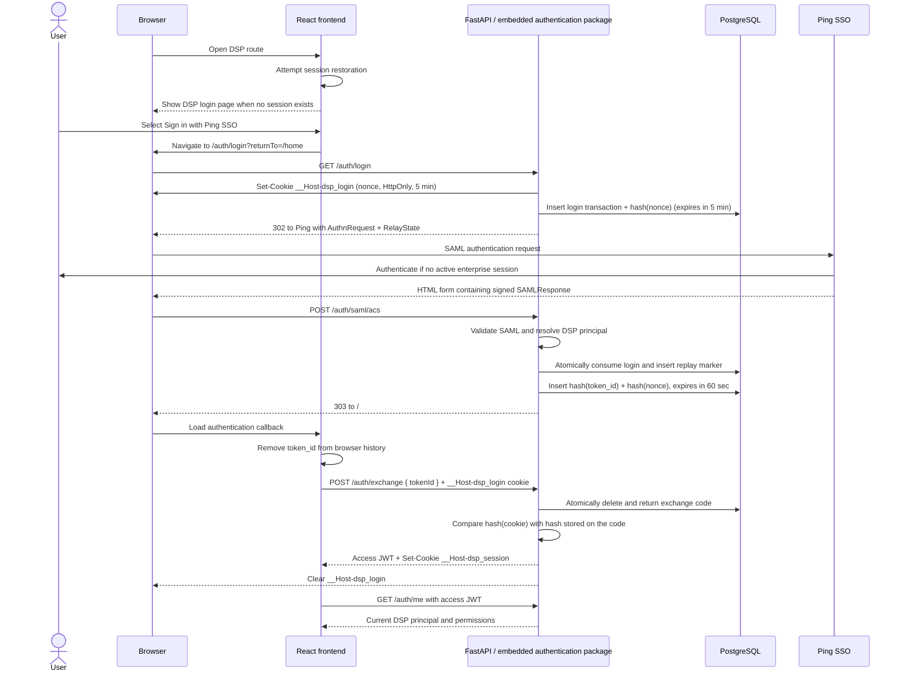
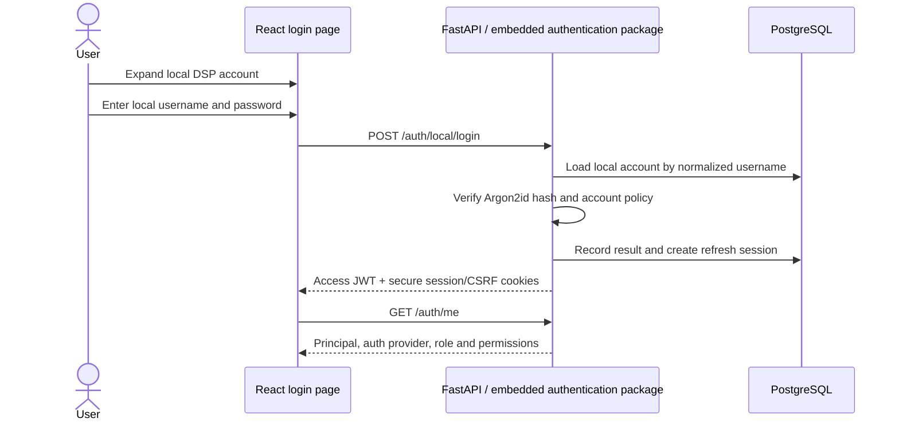

# DSP Portal Authentication — Ping SSO and Local Users

| Field | Value |
| --- | --- |
| Status | Implementation in progress — Ping IAM values and enterprise registration remain open |
| Version | 0.7 — records the hardened parallel-provider implementation |
| Owner | DSP Platform |
| Scope | Phase 1: SP-initiated Ping SAML 2.0 SSO, governed local users, and `ADMIN`/`READ_ONLY` authorization |
| Last updated | 2026-08-26 |

## 0. Revision note

Version 0.7 records the implemented parallel-provider contract and the hardening review: current-state authorization, approved Ping access groups, assertion-derived authentication time, one-time password actions, PostgreSQL throttling/idempotency, browser callback safety, and production fallback removal. Section numbering from v0.1 is preserved so existing references remain valid.

| Review finding | Where it landed |
| --- | --- |
| S-01 — SAML vs OIDC | **Closed.** OIDC unavailable; SAML 2.0 confirmed. Decision 13; library and base image fixed in §12 |
| S-02 — exchange not bound to the browser | Decision 14; §6, §7 `/auth/login` and `/auth/exchange`; §17 gate |
| S-03 — refresh session transport unspecified | Decision 15; §7, §9 |
| S-04 — authorization scope | Decision 17; §10 split into Tier 1 and Tier 2; §16 Stage 3 split into 3a and 3b |
| S-05 — `InResponseTo` conditional | Decision 18; §8.1; §17 gate |
| S-06 — shared authentication-state availability | PostgreSQL transaction semantics and failure behavior in decisions 11 and 16; §6, §13 |
| S-07 — dev-only in-memory store | Removed from §5.1 and §6 |
| S-08 — SAML library unnamed | Decision 13; §12 |
| S-09 — no rate limiting, unspecified code entropy | §7, §9 |
| S-10 — Hive and YARN out of Phase 1 | §10 marked as later-phase |
| S-11 — clock skew | §11, reduced to 60 seconds |
| S-12 — durable identifier unanchored | §5.2, §8.2 |
| S-13 — attribute contract unfulfilled | **New §8.2**; §18 questions |
| S-14 — Redis excluded from release one | **Closed.** Dedicated PostgreSQL tables provide login, replay, exchange-code and refresh-session state; §6, §12, §13, §16 |
| S-15 — login experience unspecified | **Closed.** DSP login, callback, restoration, denial and failure states are defined in decision 19; §5.4, §15, §16, §17 |
| S-16 — local users and role model | **Closed.** Governed local accounts and exactly two portal roles are defined in decisions 20–21; §5.5, §7, §10, §15–17 |
| I-05 — SAML authentication time used processing time | **Closed.** Decision 23; the validated assertion's `AuthnInstant` is parsed and tested, and Ping session expiry caps DSP refresh |
| I-06 — provider behavior ambiguous | **Closed.** Decision 22; Ping and local authentication coexist, and Ping degradation never disables local login |

## 1. Purpose and scope

This document defines the target authentication design for the React frontend and FastAPI backend. It also defines how the implementation will remain reusable while initially living inside the existing DSP repositories.

Phase 1 will provide:

- enterprise authentication through Ping SSO using SAML 2.0;
- local DSP authentication for explicitly provisioned users;
- a 60-second, single-use browser exchange code (`token_id`), bound to the browser that began the login;
- short-lived JWT access tokens for DSP APIs;
- backend-enforced `ADMIN` and `READ_ONLY` authorization;
- a DSP-owned login page with enterprise SSO and local-account routes;
- exactly two application roles: `ADMIN` and `READ_ONLY`;
- an embedded authentication package that can be extracted for other teams later.

This design does not make the frontend a SAML service provider. The FastAPI backend is the SAML service provider and the only component that accepts or validates a SAML assertion. Local credentials are submitted only to a dedicated backend endpoint over TLS and are never sent to Ping.

## 2. Final architecture decisions

1. The user selects **Sign in** in React. The browser navigates to `GET /auth/login`; this is a top-level redirect, not an AJAX request.
2. The backend creates a SAML authentication request, stores a login transaction in PostgreSQL, and redirects the browser to Ping SSO.
3. Ping authenticates the user and posts the signed `SAMLResponse` to the backend assertion consumer service (ACS).
4. The backend fully validates the response before resolving the DSP user, LDAP groups, teams and roles.
5. The raw SAML response is discarded after validation. It is never returned to React or retained as session state.
6. The backend creates a cryptographically random `token_id` of at least 256 bits. Only its SHA-256 hash is stored in PostgreSQL, with a 60-second expiry and atomic, single-use consumption.
7. The backend redirects the browser to the frontend callback with the opaque `token_id` **in the URL fragment, never the query string**.
8. React removes `token_id` from the browser URL immediately and exchanges it with the backend for an application session.
9. Access JWTs are short-lived and held in frontend memory only. They are not stored in `localStorage` or `sessionStorage`.
10. Every protected API performs backend authorization. Showing or hiding navigation in React is not a security control.
11. **Redis is not used in release one.** PostgreSQL is the shared authentication-state store for all backend instances. Dedicated tables, unique constraints and transactional consume operations provide login correlation, replay protection, one-time code exchange and refresh-session revocation. There is no in-memory fallback in any environment.
12. The reusable authentication implementation remains in the backend and frontend repositories for now. Its dependency boundaries must allow later extraction without rewriting DSP business logic.
13. **SAML 2.0 is confirmed.** Ping OIDC is not available for this application. The SAML implementation is `python3-saml`, pinned to an exact version, with a named owner for its security advisory feed. The runtime base image is Debian slim; Alpine is not used.
14. **The exchange code is bound to the browser that began the login.** `GET /auth/login` issues a nonce cookie whose hash travels server-side only. `POST /auth/exchange` refuses any code presented without the matching cookie. A leaked `token_id` alone is not sufficient to obtain a session.
15. **The refresh session is an `HttpOnly` cookie; the access token is not.** The access JWT stays in JavaScript memory. The session identifier that permits refresh is a `__Host-` prefixed, `HttpOnly`, `Secure`, `SameSite=Strict` cookie with `Path=/`, and is never readable by page script.
16. **Access-token cryptography is self-contained; authorization is current-state.** The JWT is validated by signature, issuer, audience and time claims, then every protected request verifies its principal, authorization version and refresh-session record in PostgreSQL. A PostgreSQL outage therefore fails protected requests closed, while logout, disablement and role changes take effect immediately.
17. **Phase 1 authorization is Tier 1 only** (§10): authenticated principal, canonical `ADMIN` or `READ_ONLY` role, and resources scoped by owner. Ping group mapping and governed local assignment are inputs to that canonical role. The team, group and entitlement model is Tier 2 and is sequenced with the data-model work.
18. **IdP-initiated SSO is disabled at the Ping SP registration, and `InResponseTo` is mandatory without exception.** An assertion that does not correspond to a stored login transaction is rejected.
19. **The frontend owns the DSP login experience.** Enterprise authentication remains the primary route: **Sign in with Ping SSO** navigates to backend `/auth/login`, and DSP never embeds Ping or collects enterprise credentials. A secondary **Use a local DSP account** action reveals the governed local username/password form.
20. **Local accounts are explicitly governed application identities.** There is no public registration. An `ADMIN` creates, disables, unlocks, expires or resets a local account through audited backend workflows. Passwords are stored only as Argon2id hashes with per-password salts; plaintext and reversible passwords are never persisted or logged.
21. **DSP has exactly two portal roles.** `READ_ONLY` is the default and may view only resources allowed by its user/team scope. `ADMIN` includes read access and may invoke explicitly authorized management APIs. Role checks and resource-scope checks are separate and are enforced by FastAPI on every endpoint; React visibility is presentational only.
22. **Ping SSO and governed local authentication operate in parallel.** Local sign-in is always present, including when Ping is healthy. Missing or incomplete Ping settings mark only Ping as unavailable/degraded; they never disable local sign-in. There is no provider enable/disable flag.
23. **SAML authentication age comes from the signed assertion.** `authentication_time` is parsed from the validated assertion's `AuthnStatement/@AuthnInstant`; request-processing time is never substituted. Ping session expiry caps the DSP refresh session, and Ping-derived administrators must reauthenticate after the configured authorization-freshness interval.

## 3. Authentication sequence



Local authentication converges on the same session and authorization pipeline without a SAML exchange:



The preferred deployment uses one public origin with ingress routing:

- `/` to React;
- `/api/*` to the DSP API;
- `/auth/*` to the authentication endpoints.

This reduces CORS and cookie complexity, and is what makes the `__Host-` cookie prefix available. Separate origins may be supported, but must use an exact origin allow-list and an explicitly reviewed cookie policy.

## 4. Trust boundaries and responsibilities

| Component | Owns | Must not own |
| --- | --- | --- |
| Ping SSO | Credential entry, enterprise authentication, signed SAML assertion | DSP resource authorization |
| Embedded authentication package | Ping SAML protocol, local-password verification, login/replay/code/session state, browser binding, generic identity and token lifecycle | LDAP-to-team or DSP-resource decisions |
| DSP backend adapters | DSP principal resolution, local-account governance, LDAP groups, teams, roles and resource authorization | Enterprise credential collection or SAML parsing |
| React auth module | Redirect, callback exchange, in-memory access token and auth state | SAML assertions or security decisions |
| React DSP integration | User/admin presentation and protected navigation | Authoritative authorization |
| PostgreSQL authentication schema | Local-account password hashes plus expiring login, replay, exchange-code and refresh-session records | Raw SAML assertions, plaintext/reversible passwords or unhashed public secrets |
| PostgreSQL application schema | DSP users, teams, LDAP mappings, roles and managed-resource relationships | Raw SAML assertions or credentials |

## 5. Embedded reusable module design

### 5.1 Backend

The generic package will be a top-level Python package, separate from the DSP application package:

```text
dsp-portal-backend/
├── enterprise_auth/
│   ├── config.py
│   ├── models.py
│   ├── exceptions.py
│   ├── providers/
│   │   ├── ping_saml/
│   │   │   ├── request.py
│   │   │   ├── validator.py
│   │   │   └── metadata.py
│   │   └── local/
│   │       ├── password.py
│   │       └── protocol.py
│   ├── state/
│   │   ├── protocol.py
│   │   └── postgres.py
│   ├── tokens/
│   │   ├── protocol.py
│   │   └── jwt.py
│   ├── fastapi/
│   │   ├── router.py
│   │   ├── dependencies.py
│   │   └── middleware.py
│   └── audit/
│       ├── protocol.py
│       └── logging.py
└── app/
    └── auth/
        ├── local_accounts.py
        ├── principal_resolver.py
        ├── authorization.py
        └── audit_adapter.py
```

There is one state implementation, backed by PostgreSQL. An in-memory adapter is not provided: production forbids it, so a second implementation of a security-critical store would be a code path that is never exercised in the environment that matters. Local development uses the same PostgreSQL migrations as deployed environments. `state/protocol.py` is retained as the extraction seam.

The dependency direction is strictly:

```text
app  ───────►  enterprise_auth
DSP adapters    generic authentication package
```

`enterprise_auth` MUST NOT import `app` or refer to DSP roles, teams, Hive tables, YARN queues, VMs, devspaces or jobs.

The generic package owns:

- SAML request creation, response validation and metadata handling;
- password hashing and constant-time verification primitives for local authentication;
- login transaction, replay, exchange-code and session stores;
- the login-nonce binding between `/auth/login` and `/auth/exchange`;
- a generic authenticated identity contract;
- access-token/session creation and validation;
- generic FastAPI routes and authentication dependencies;
- security audit events without DSP-specific policy.

The DSP application owns:

- mapping Ping attributes to the canonical DSP user;
- provisioning, disabling, locking, expiring and resetting local accounts;
- LDAP group and team relationships;
- mapping both authentication providers to exactly one `ADMIN` or `READ_ONLY` role;
- access filtering for VMs, devspaces and jobs in Phase 1, and for Hive metadata, ingestion status and YARN queues in a later phase;
- DSP-specific audit context and API authorization.

### 5.2 Generic identity contract

The authentication boundary produces a generic identity similar to:

```text
AuthenticatedIdentity
├── authentication_provider  -- PING_SAML or LOCAL
├── issuer
├── subject                   -- human-readable NameID or local username; NOT the join key
├── durable_subject           -- objectGUID or immutable local-account UUID; the join key
├── enterprise_user_id (optional)
├── display_name (optional)
├── email (optional)
├── groups: list<string>
├── attributes: map<string, list<string>>
├── authentication_time
├── authentication_context (optional)
└── assertion_id (Ping SAML only)
```

The DSP `PrincipalResolver` converts this into the application-specific `CurrentDspPrincipal`.

For Ping, `durable_subject` carries the AD `objectGUID`; for local authentication it carries the immutable local-account UUID. Both are persisted to `principal_identity.external_object_id`, under the existing `UNIQUE (identity_provider_id, external_object_id)` constraint. It is the only field used to recognise a returning user. `subject` is retained for support conversations and must never be used as a join key: it is mutable, and a change to it would present an existing user as a new principal with no devspaces, jobs or ownership history. See §8.2.

### 5.3 Frontend

```text
dsp-portal-frontend/src/auth/
├── core/
│   ├── AuthProvider.tsx
│   ├── LoginPage.tsx
│   ├── AuthStatusPage.tsx
│   ├── auth-api.ts
│   ├── token-store.ts
│   ├── types.ts
│   └── index.ts
├── ping-sso/
│   └── AuthCallback.tsx
├── local/
│   ├── LocalLoginForm.tsx
│   └── LocalPasswordActionPage.tsx
└── dsp/
    ├── DspProtectedRoute.tsx
    ├── DspAuthorization.ts
    └── DspUserControl.tsx
```

The `core`, `ping-sso` and `local` modules MUST NOT import DSP roles or components. The DSP layer consumes the generic session API and maps permissions to the portal experience.

`auth-api.ts` must send credentials on `/auth/exchange`, `/auth/refresh` and `/auth/logout` so the login and session cookies are included. `token-store.ts` holds the access token in a module-scoped variable only; it must not touch `localStorage`, `sessionStorage`, IndexedDB or a cookie.

### 5.4 Login and authentication UX

The login page is a deliberate part of release one, not a temporary developer screen. It is served by React at `/#login` before the protected application shell loads.

Conceptual desktop layout:

```text
┌──────────────────────────────────────────────────────────────────────┐
│ DSP | Data Science Platform                                         │
├──────────────────────────────────────────────────────────────────────┤
│                                                                      │
│                 ┌──────────────────────────────────┐                 │
│                 │ Sign in to DSP                   │                 │
│                 │                                  │                 │
│                 │ Use your enterprise account to   │                 │
│                 │ access the Data Science Platform.│                 │
│                 │                                  │                 │
│                 │ [ Sign in with Ping SSO ]        │                 │
│                 │                                  │                 │
│                 │ Use a local DSP account           │                 │
│                 │                                  │                 │
│                 │ Having trouble signing in?       │                 │
│                 │ Contact DSP support              │                 │
│                 └──────────────────────────────────┘                 │
│                                                                      │
└──────────────────────────────────────────────────────────────────────┘
```

The screen uses the portal's existing enterprise design language: calm, compact and operational. It must not contain a marketing hero, promotional metrics, onboarding content, fake credentials or a dummy user.

#### Page behavior

1. A user opening a protected route is held behind an authentication boundary while React attempts session restoration.
2. When a session cookie exists, React reads the CSRF cookie and attempts one refresh before deciding the user is signed out. If no recoverable DSP session exists, React shows `/#login` and retains the attempted destination as an allow-listed logical route ID in memory.
3. Selecting **Sign in with Ping SSO** performs a top-level navigation to `/auth/login?returnTo=<route-id>`. The frontend does not call Ping directly or construct a SAML request.
4. Selecting **Use a local DSP account** expands the secondary local form without navigating away. Enterprise SSO remains the visually dominant and initially focused action.
5. While SSO navigation begins, the button is disabled and its label changes to **Redirecting to Ping SSO…** to prevent duplicate login attempts.
6. After SSO exchange or local authentication succeeds, React obtains `/auth/me` and navigates to the stored route. Unknown or disallowed route IDs resolve to `#home`.
7. Sign-out clears the memory token, invokes backend logout, and returns to `/#login` with a neutral **You have signed out** message.

The current portal uses hash navigation such as `#home`, `#vms` and `#admin`. The authentication implementation therefore treats `returnTo` as a logical route identifier—not an arbitrary path or URL—and translates it to the appropriate hash only after authentication. This prevents an open redirect and avoids mixing server paths with client hash routes.

#### Required UI states

| State | User experience | Available action |
| --- | --- | --- |
| Checking session | Full-page DSP loading state; application data is not requested | None |
| Signed out | Login card with the primary enterprise route and collapsed local route | Sign in with Ping SSO / use local DSP account |
| Local sign-in | Username and password fields with password visibility off by default | Sign in / return to enterprise SSO |
| Redirecting | Disabled primary button and progress indicator | None |
| Completing sign-in | Minimal callback progress screen while the 60-second code is exchanged | None |
| Exchange expired/invalid | Neutral message without protocol details or account disclosure | Start sign-in again |
| DSP access denied | User was authenticated but is not authorized for DSP; show correlation ID | Contact DSP support / sign out |
| Authentication unavailable | Ping, PostgreSQL or backend authentication dependency is unavailable | Try again / contact DSP support |
| Signed out successfully | Confirmation without revealing previous session details | Sign in again |

The UI must not distinguish an unknown user from a disabled or unauthorized account. Detailed reasons are emitted only to the protected audit log against the correlation ID.

#### Accessibility and security requirements

- The primary action is keyboard accessible, has a visible focus state and uses text rather than an icon alone.
- Loading and error changes use an accessible live region; focus moves to the error heading after failure.
- Authentication and callback responses use `Cache-Control: no-store` and `Referrer-Policy: no-referrer`.
- The callback removes `token_id` from browser history before any telemetry, support widget or application API is initialized.
- No protected navigation, top bar, dummy identity, preview data or platform content is rendered behind the login card.
- Pre-authentication support destinations are explicitly configured and limited to an approved DSP support route; service and operational data remain protected.

### 5.5 Local-account authentication

Local authentication is a separate provider that converges on the same `AuthenticatedIdentity`, principal resolution, token issuance, refresh-session and authorization pipeline as Ping SSO.

Local-account rules:

- There is no self-registration and no anonymous account-discovery endpoint.
- Usernames are unique and compared case-insensitively after Unicode normalization.
- Passwords are hashed with Argon2id using the enterprise-approved parameters and a unique salt. An optional server-side pepper, when required by security, is loaded from CyberArk and is never stored in PostgreSQL.
- Login responses use the same generic error for unknown username, invalid password, disabled account, expired account and lockout. Detailed reasons appear only in the protected audit log.
- Per-account and per-source throttling, progressive delay and an approved temporary lock policy apply before password verification can become a denial-of-service or credential-stuffing vector.
- Successful login rotates the refresh session, resets the failure counter, updates `last_login_at`, returns the short-lived access JWT and sets the same secure session cookie used after SSO.
- Account creation, role changes, disablement, unlock, expiry and password reset are `ADMIN` operations and create immutable audit events.
- Password setup/reset uses a random, hash-stored, single-use action code with a short expiry. Administrators never view or distribute a permanent password, and passwords are never sent by email or written to logs.
- Local `ADMIN` accounts require explicit security approval. The number of active local administrators should remain minimal; emergency accounts and their password material follow the enterprise CyberArk/break-glass process.
- The first `ADMIN` comes from the approved Ping admin group. If security requires a local break-glass administrator before Ping is available, it is provisioned only through a controlled offline bootstrap command/migration with dual approval and CyberArk-managed activation material—never through an anonymous HTTP endpoint.

There is no local-authentication feature switch. Governed local accounts and their endpoints are part of every release-one build and remain usable whether Ping is configured, unavailable or healthy. Ping availability is derived from whether its required SP, IdP and approved-access-group settings form a complete configuration; partial Ping configuration is reported as incomplete and cannot start a SAML flow. There is no `AUTH_ENABLED`, `LOCAL_AUTH_ENABLED` or `SAML_STRICT` bypass.

## 6. Runtime state

Release one stores authentication state in a dedicated PostgreSQL schema. Public secrets are never stored in plaintext; lookup columns contain SHA-256 hashes of values generated with at least 256 bits of cryptographic entropy.

| Table | Retention | Contents | Security behavior |
| --- | --- | --- | --- |
| `auth.saml_login_transaction` | 5 minutes | RelayState hash, SAML request ID, safe return path, login-nonce hash, created/expires times | Consumed by ACS; return path must be local and allow-listed |
| `auth.saml_assertion_replay` | Until SAML `NotOnOrAfter`, plus approved clock-skew margin | Assertion-ID hash, issuer and expiry | Unique assertion-ID constraint; a duplicate insert is rejected |
| `auth.exchange_code` | **60 seconds** | Token hash, principal ID, auth time, return path, role/version reference, login-nonce hash, created/expires times | Deleted and returned atomically; never reusable; refused if the presented cookie does not match |
| `auth.refresh_session` | Enterprise session policy | Session-ID hash, CSRF-token hash, principal ID, authorization snapshot/version, auth time, issued/expires/revoked/rotated times | Read only on refresh and logout, never to validate an access JWT |
| `auth.local_account` | Until governed deletion/retention | Principal ID, normalized username, Argon2id hash, status, failure/lock state, password/account expiry and audit timestamps | No plaintext/reversible password; disabled and expired accounts fail closed |
| `auth.local_password_action` | Approved short setup/reset lifetime | Action-code hash, local-account ID, purpose, created/expires/consumed times | Hash-stored, single-use and consumed atomically |

The PostgreSQL implementation must provide these atomic operations:

1. `consume_login_and_record_assertion`: lock and consume the matching, unexpired login transaction; insert the assertion replay marker under a unique constraint; and create the exchange code in one database transaction. A concurrent ACS request must not create a second code.
2. `consume_exchange_code`: delete and return the matching, unexpired exchange-code row only when the browser nonce hash matches. PostgreSQL `DELETE ... RETURNING` is the expected primitive.
3. `rotate_refresh_session`: lock the current session, reject expired/revoked/reused state, revoke or rotate the current identifier and create its successor in one transaction.
4. `record_local_login_attempt`: update failure count, lock state and successful-login facts atomically without creating an account-enumeration side channel.
5. `consume_local_password_action`: consume the unexpired action code, replace the password hash and revoke the account's refresh-session family in one transaction.

Indexes are required on every hash lookup and `expires_at` column. A scheduled cleanup task deletes expired login, replay and exchange rows in bounded batches; expiry is still checked in every consuming SQL statement, so cleanup delay never makes expired state valid.

All backend replicas use the same PostgreSQL service, so no sticky session is required. PostgreSQL connections use TLS and runtime-injected credentials. Database backup policy should exclude or tightly limit restoration of expired authentication state; a restored replay or exchange record must never become valid because all operations enforce `expires_at` against current database time.

## 7. HTTP endpoint contract

All authentication endpoints are rate limited per source address and per session. `POST /auth/saml/acs` is limited most tightly: signed-XML validation is computationally expensive and is otherwise a cheap denial-of-service target.

### `GET /auth/config`

- Returns only non-sensitive login capabilities and approved UI labels, including derived Ping availability and the always-present governed local-account route.
- Is cacheable only for a short configured interval and never exposes Ping metadata, group mappings, password policy internals or environment secrets.
- The backend remains authoritative: hiding a provider in React does not enable or disable its endpoint.

### `GET /auth/login?returnTo=/home`

- Creates the SAML request and login transaction.
- Accepts only a local, allow-listed return path; arbitrary URLs are rejected. The return path is stored server-side against the login transaction and never carried by the browser.
- Generates a login nonce of at least 256 bits and sets it as a cookie:

  ```text
  Set-Cookie: __Host-dsp_login=<nonce>; HttpOnly; Secure; SameSite=Lax; Path=/; Max-Age=300
  ```

  `SameSite=Lax` is deliberate. The flow returns from Ping through a cross-site navigation, and `Strict` cookies are withheld on the first same-site load that follows one. `Lax` blocks the attack this defends against, because an attacker holding only a leaked `token_id` cannot produce the cookie.
- Stores `sha256(nonce)` on the login transaction.
- Returns a `302` redirect to Ping SSO.

### `POST /auth/local/login`

Request:

```json
{"username": "local-user", "password": "<submitted-over-TLS>", "returnTo": "home"}
```

- Is always present; only explicitly provisioned, enabled accounts can authenticate and there is no self-registration route.
- Requires same-origin Fetch Metadata, an exact approved `Origin`, `Content-Type: application/json`, strict body-size limits and local-login rate limits.
- Normalizes the username, performs constant-time Argon2id verification and applies the account status, expiry and lock policy.
- Returns the same generic `invalid_credentials` result for an unknown, invalid, disabled, expired or locked account.
- Resolves the associated DSP principal and its current `ADMIN` or `READ_ONLY` role.
- On success, creates the same refresh-session and access-JWT contract used by the SAML exchange; it does not create or require a SAML exchange code.
- Clears the password value from application references as soon as verification completes and never includes it in telemetry, validation errors or exception context.

### `POST /auth/local/password-action`

- Accepts a hash-stored, single-use setup/reset action code and the new password.
- Validates purpose, account, expiry, password policy and one-time consumption in one PostgreSQL transaction.
- Revokes all existing refresh sessions for the local account after a successful password reset.
- Returns a generic invalid/expired action response and directs the user back to local sign-in.

### `POST /auth/saml/acs`

- Accepts Ping's form-encoded `SAMLResponse` and `RelayState`.
- Applies strict body-size limits, rate limiting and the SAML validation in §8.
- Resolves/provisions the DSP principal according to approved policy, keyed on the durable subject (§5.2, §8.2).
- Creates the 60-second exchange code and copies `sha256(nonce)` onto it from the login transaction.
- Returns a `303` redirect to the configured frontend callback, with `token_id` **in the URL fragment**:

  ```text
  Location: https://dsp.example.enterprise/#auth/callback?token_id=<value>
  ```

  The fragment is mandatory, not a preference. In the query string the code reaches the ingress access log, the WAF log and any downstream SIEM, and a 60-second lifetime is ample for an automated log reader.
- Does not expose the SAML response to the frontend.

### `POST /auth/exchange`

Request:

```json
{"tokenId": "opaque-one-time-value"}
```

Sent with credentials, so `__Host-dsp_login` is included.

- Atomically consumes the exchange-code record.
- Compares `sha256(__Host-dsp_login)` with the hash stored on the code. On mismatch or absence, refuses, discards the code, and emits a reason-coded security event.
- Returns a generic `invalid_or_expired_code` for an absent, expired, reused or unbound code. The four cases are indistinguishable to the caller and distinguishable in the audit log.
- Creates the application access token, and the refresh session as a cookie:

  ```text
  Set-Cookie: __Host-dsp_session=<id>; HttpOnly; Secure; SameSite=Strict; Path=/; Max-Age=<session ttl>
  Set-Cookie: __Host-dsp_csrf=<random>; Secure; SameSite=Strict; Path=/; Max-Age=<session ttl>
  ```

- Stores the CSRF-token hash on the refresh session. Page script sends the readable CSRF value as `X-CSRF-Token`; refresh and logout require the header, cookie and stored hash to match, together with exact `Origin` validation.
- Clears `__Host-dsp_login`.

### `GET /auth/me`

- Requires a valid access token.
- Returns the current DSP user, team, singular role (`ADMIN` or `READ_ONLY`), authentication provider and frontend-relevant permissions.
- Does not return raw SAML attributes unless explicitly approved for the UI contract.

### `POST /auth/refresh`

- Requires `__Host-dsp_session`, `__Host-dsp_csrf`, matching `X-CSRF-Token` and an approved `Origin`.
- Re-reads current principal status and role, then atomically rotates the refresh-session identifier, CSRF token and access token.
- Rejects revoked or expired sessions.

### `POST /auth/logout`

- Requires `__Host-dsp_session`, `__Host-dsp_csrf`, matching `X-CSRF-Token` and an approved `Origin`.
- Revokes the DSP session and clears the login, session and CSRF cookies.
- A later phase may add Ping single logout after enterprise validation; local logout is mandatory for Phase 1.

If other services must validate DSP access tokens directly, a JWKS endpoint may be added. It is not required while all protected requests terminate at the DSP backend.

### Local-account administration APIs

The `/api/v1/admin/local-users` collection supports list, create, disable, enable, unlock, role change, expiry change and password-action issuance. Every operation:

- requires the caller's current PostgreSQL principal status and `ADMIN` role, not only a JWT claim;
- is protected against an administrator disabling or demoting the final active administrator;
- accepts an idempotency key for mutations;
- records actor, target, before/after state, timestamp, reason and correlation ID;
- never returns `password_hash` or a plaintext password.

## 8. Mandatory SAML validation

### 8.1 Validation checks

The ACS must reject a response unless **all** of the following pass. There are no conditional checks: a check that cannot be performed is a rejection, not an exemption.

- secure XML parsing with external entities and unsafe expansion disabled;
- maximum request and decoded-assertion sizes;
- response/assertion signature according to the agreed Ping profile;
- signing certificate anchored to trusted Ping metadata;
- expected issuer;
- exact SP audience/entity ID;
- exact destination and subject-confirmation recipient;
- **`InResponseTo` present and matched to a stored login transaction. An assertion carrying no `InResponseTo` is rejected.** IdP-initiated SSO is disabled at the Ping SP registration; this check is the control that enforces it, and prevents an attacker replaying their own valid assertion into a victim's browser to sign the victim in as the attacker;
- **`RelayState` present, unpredictable, matching and unexpired**, under the same rule;
- `NotBefore` and `NotOnOrAfter`, with a small configured clock skew;
- acceptable authentication context when required by policy;
- assertion-ID replay prevention;
- required subject and identity attributes, per §8.2;
- encrypted assertion handling if mandated by Ping/security.

Servers must use synchronized enterprise time. Validation failures produce a generic user-facing error and a reason-coded security event; tokens, assertions, credentials and complete sensitive attributes must never be logged.

### 8.2 Required attribute contract

The draft contract received from Ping fulfils every assertion attribute from `subject`:

| Assertion attribute | Fulfilled from | Result |
| --- | --- | --- |
| `SAML_SUBJECT` | `subject` | Correct — this is the NameID |
| `USER_ID` | `subject` | The same string again |
| `NAME` | `subject` | Not a display name |
| `EMAIL` | `subject` | Not an email address |
| `GIVEN_NAME` | `subject` | Not a first name |
| `FAMILY_NAME` | `subject` | Not a surname |
| `LDAP Groups` | `subject` | Not a group list |

This is a declared but unfulfilled contract. Where no LDAP datastore is attached to the adapter mapping on the SP connection, `subject` is the only value the adapter exposes and every attribute defaults to it.

As drafted the assertion carries no groups, so a Ping-authenticated principal cannot be mapped safely to `ADMIN` and nothing can be scoped by team. It also carries no immutable identifier, which makes §5.2 unimplementable. Local-account authorization does not remove these Ping contract requirements.

The contract DSP requires:

| Assertion attribute | AD source | Persisted to | Purpose |
| --- | --- | --- | --- |
| `USER_ID` | `objectGUID` | `principal_identity.external_object_id` | The immutable join key. Required. |
| `SAML_SUBJECT` | `sAMAccountName` | `principal_identity.username` | Human-readable, for logs and support. Never a join key. |
| `LDAP_GROUPS` | `memberOf`, multi-valued, filtered to the DSP group naming convention | Not persisted in Phase 1 | `ADMIN` mapping and team scope. Required. |
| `EMAIL` | `mail` | `principal.email` | Display and notification. |
| `GIVEN_NAME` | `givenName` | `principal.display_name` | Display. |
| `FAMILY_NAME` | `sn` | `principal.display_name` | Display. |
| `EMPLOYEE_ID` | `employeeID` | `principal.enterprise_user_id` | Optional. Reconciliation against HR and Remedy. |

Three requirements to confirm in writing with Ping IAM:

1. **The `objectGUID` encoding is agreed and frozen.** It is a binary GUID and may be emitted base64 or as dashed hexadecimal. A change of representation silently breaks `UNIQUE (identity_provider_id, external_object_id)` and re-creates every user as a new principal.
2. **`memberOf` is filtered at the Ping end** to groups matching the DSP naming convention. A user in two hundred AD groups otherwise ships a large assertion on every login for the handful of groups DSP consumes.
3. **The attribute is named `LDAP_GROUPS`**, not `LDAP Groups`. A space in an attribute name is legal and invites encoding defects, and costs nothing to correct before anything consumes it.

If enterprise policy prohibits group membership in an assertion, the fallback is a nightly LDAP synchronisation into `directory_group` and `directory_group_membership`, with authorization resolved from PostgreSQL at login. DSP must not query LDAP on the request path in any case.

## 9. JWT and session policy

Phase 1 defaults:

| Setting | Default |
| --- | --- |
| Exchange-code lifetime | 60 seconds |
| Exchange-code entropy | ≥ 256 bits from a cryptographic source |
| Login-nonce entropy | ≥ 256 bits from a cryptographic source |
| Access-JWT lifetime | 10 minutes |
| Signing | Asymmetric enterprise-approved algorithm |
| Browser access-token storage | Memory only |
| Refresh/session transport | `__Host-dsp_session`, `HttpOnly`, `Secure`, `SameSite=Strict`, `Path=/` |
| CSRF transport | `__Host-dsp_csrf`, `Secure`, `SameSite=Strict`, `Path=/`, plus matching `X-CSRF-Token` |
| Refresh/session lifetime | To be confirmed with enterprise security; maximum 8 hours proposed |

Access-token cryptography is self-contained, but authorization is deliberately not stale: every protected request validates signature, issuer, audience, `nbf` and `exp`, then verifies the current PostgreSQL principal, role, `authorization_version` and refresh-session record identified by `sid`. This makes logout, account disablement, password reset and role changes effective immediately. If PostgreSQL is unavailable, protected requests fail closed and readiness reports unavailable.

JWT claims should be minimal:

- `iss`, `aud`, `sub`, `sid`, `jti`;
- `iat`, `nbf`, `exp`;
- `auth_provider`, singular `role` (`ADMIN` or `READ_ONLY`) and `authorization_version`.

`sub` carries the DSP principal identifier, not the Ping NameID or local username.

JWTs must not contain the SAML assertion, credentials, secrets, excessive LDAP membership or unnecessary personal data. Signing keys are loaded from CyberArk or the approved enterprise key-management mechanism, use a `kid`, and have a documented overlap/rotation procedure.

The initial token is DSP application-specific. If the enterprise later requires one token trusted by multiple applications, issuance should move to an approved central authorization server; individual applications should not independently become enterprise-wide token issuers.

## 10. Authorization model

Authentication establishes identity through either Ping SAML or a governed local account. DSP authorization is provider-independent and is evaluated against the canonical PostgreSQL principal role and resource relationships.

Backend dependencies will include equivalents of:

- `require_authenticated_user`;
- `require_role(ADMIN | READ_ONLY)`;
- `require_admin`;
- `require_resource_access(resource_type, resource_id)`.

These signatures are fixed from Phase 1. Only their implementation changes between tiers.

### 10.1 Two-role model

Every active human principal has exactly one portal role:

| Role | Capability | Resource scope |
| --- | --- | --- |
| `READ_ONLY` | View permitted dashboards, status, metadata, guides, jobs, devspaces, VMs and support routes. Cannot mutate portal or managed-platform state | Limited by the principal's user/team/resource relationships |
| `ADMIN` | Includes read capability and may use explicitly authorized administration, publishing, allocation and local-user-management APIs | Platform-wide only where the specific admin API grants it; secrets and source-system controls remain separately governed |

`READ_ONLY` is the fail-closed default. `ADMIN` is not a separate user type and does not bypass resource or workflow rules implicitly. The backend attaches a single `role` claim and an `authorization_version` to the access JWT; it never accepts a role supplied by the frontend.

For Ping users, approved `LDAP_GROUPS` values map to `ADMIN`; all other authorized DSP users map to `READ_ONLY`. For local users, an existing `ADMIN` assigns the role through the governed local-account workflow. Changes update the canonical principal role and authorization version. Refresh always reads the current value, and admin APIs additionally verify current principal status and role from PostgreSQL so a local role/status change takes effect without waiting for JWT expiry.

A Ping-derived `ADMIN` session cannot refresh its admin authorization indefinitely from the original assertion. Once `DSP_ADMIN_REAUTH_SECONDS` has elapsed since the SAML authentication time, refresh requires a new Ping authentication result so current group membership is evaluated again. The approved value defines the maximum Tier 1 delay for reflecting removal from the Ping admin group until directory synchronization is introduced.

### 10.2 Tier 1 — ships with authentication

Tier 1 implements the approved principal, identity, local-account and role fields together with the authentication-state tables. It does not depend on the later team/group entitlement synchronization.

| Area | Minimum backend policy | Source of truth |
| --- | --- | --- |
| User homepage/activity | Current authenticated principal | Access token |
| Devspaces, jobs, VMs | Resources whose owner resolves to the current principal | Devspace owner label, reconciled inventory |
| Platform administration | Current active principal with `ADMIN`; Ping group mapping or governed local assignment establishes the canonical role | PostgreSQL principal role plus current status; Ping claim is an input, not the request-time authority |
| Support content | Both roles may read; only `ADMIN` may create, edit or publish | Canonical role and content workflow policy |
| Local users | `ADMIN` only; protect final active admin | Canonical role, current principal status and audited local-account workflow |

### 10.3 Tier 2 — sequenced with the data-model work

Tier 2 depends on `directory_group`, `directory_group_membership`, `team`, `team_membership`, `team_group_binding`, `access_subject`, `resource_access` and `service_entitlement`, together with a directory synchronisation to populate them. None of these are delivered by Phase 1 of the portal, and this plan does not assume them.

| Area | Minimum backend policy | Phase |
| --- | --- | --- |
| Team-scoped devspaces, jobs, VMs | Explicit user/team/resource relationship | Tier 2 |
| Delegated and time-bounded grants | `resource_access` with expiry | Tier 2 |
| Hive table metadata and ingestion status | Tables granted through the principal's LDAP group/team; no Hive row data is exposed | Later phase — Hive is not integrated in portal Phase 1 |
| YARN queue status | Queues associated with the principal's team | Later phase — YARN is not integrated in portal Phase 1 |

### 10.4 Rules that apply to both tiers

The React application may hide inaccessible routes and actions for usability, but a direct API call must still receive `403 Forbidden`. The dummy user must be removed once authentication is enabled, and portal/admin data must not load before authentication completes.

Production builds must not silently substitute example identities or authorization data. If an authenticated API is unavailable, the UI shows an unavailable/stale state rather than changing the user's role or resource scope.

## 11. Configuration and secrets

Recommended non-secret environment variables:

```text
DSP_FRONTEND_BASE_URL=https://dsp.example.enterprise
DSP_SAML_SP_ENTITY_ID=<registered-sp-entity-id>
DSP_SAML_ACS_URL=https://dsp.example.enterprise/auth/saml/acs
DSP_SAML_IDP_METADATA_URL=<approved-ping-metadata-url>
DSP_SAML_EXPECTED_ISSUER=<approved-ping-issuer>
DSP_SAML_CLOCK_SKEW_SECONDS=60
DSP_SAML_SIGNATURE_PROFILE=<response-or-assertion-or-both>
DSP_SAML_GROUPS_ATTRIBUTE=LDAP_GROUPS
DSP_SAML_DURABLE_SUBJECT_ATTRIBUTE=USER_ID
DSP_LOCAL_PASSWORD_ACTION_TTL_SECONDS=<approved-value>
DSP_LOCAL_MAX_FAILURES=<approved-value>
DSP_LOCAL_LOCK_SECONDS=<approved-value>
DSP_DATABASE_URL=<postgresql-endpoint-or-secret-reference>
DSP_AUTH_DATABASE_SCHEMA=auth
DSP_AUTH_CLEANUP_BATCH_SIZE=<approved-value>
DSP_AUTH_CODE_TTL_SECONDS=60
DSP_LOGIN_NONCE_TTL_SECONDS=300
DSP_JWT_ISSUER=<dsp-token-issuer>
DSP_JWT_AUDIENCE=<dsp-api-audience>
DSP_JWT_ACCESS_TTL_SECONDS=600
DSP_SESSION_TTL_SECONDS=<approved-value>
DSP_ADMIN_GROUPS=<approved-group-identifiers>
DSP_ADMIN_REAUTH_SECONDS=<approved-value>
DSP_AUTH_RATE_LIMIT_PER_MINUTE=<approved-value>
DSP_LOCAL_AUTH_RATE_LIMIT_PER_MINUTE=<approved-value>
```

Clock skew is 60 seconds rather than 120. §8.1 already mandates synchronised enterprise time, and a narrower window reduces the interval in which an assertion remains acceptable.

The following are secrets and must be injected at runtime from CyberArk or the approved secret manager, never committed, placed in `.env` examples, passed as Docker build arguments or baked into an image:

- SP private key, **if and only if** assertion decryption or AuthnRequest signing is required by the agreed Ping profile. If Ping signs the response, assertion encryption is not mandated and signed AuthnRequests are not required, DSP holds no SAML key material at all — removing a CyberArk dependency and a rotation runbook. This must be settled in Stage 1 rather than assumed;
- SP certificate where applicable;
- JWT signing private key;
- optional local-password pepper, if required by the approved password policy;
- PostgreSQL credentials;
- any metadata trust material not delivered through an approved trust bundle.

Core configuration required by both providers—PostgreSQL and JWT signing/verification keys—is readiness-critical. Ping-only configuration is evaluated independently: incomplete Ping settings report degraded Ping readiness and prevent only the SAML flow, while governed local login remains available.

## 12. Docker and build packaging

The authentication code can be packaged in the current backend image without a separate repository or image. The build must install both Python package trees:

```toml
[tool.setuptools.packages.find]
include = ["app*", "enterprise_auth*"]
```

The SAML implementation is `python3-saml`, pinned to an exact version. The security-critical surface is small enough to be read end to end, which matters when a reviewer must attest to it. `pysaml2` was considered and not selected: it is substantially larger and has historically invoked the `xmlsec1` binary as a subprocess, adding deployment surface. A named owner tracks its security advisories; SAML libraries as a class have a recurring history of signature-wrapping and canonicalisation defects, because the format invites them.

The image build should:

1. build/install the project as a wheel in a multi-stage build;
2. use the approved Debian slim enterprise base so the Python, `lxml`, `xmlsec`, OpenSSL and OS-library combination can be pinned and tested consistently. Alpine is not used in release one;
3. install `pkg-config`, `libxml2-dev` and `libxmlsec1-dev` in the build stage only; carry `libxml2` and `libxmlsec1-openssl` into the runtime stage;
4. copy source and declared package data, but no keys or local secret files;
5. run import smoke tests for both `app` and `enterprise_auth`;
6. run as a non-root user with a read-only filesystem where the platform permits it.

Redis is not installed, deployed or linked to the release-one API image. PostgreSQL schema migrations for the authentication-state and local-account tables must run as a controlled deployment step before the application rollout; application containers must not race to perform privileged schema changes at startup.

Minimum CI smoke checks:

```bash
python -c "import enterprise_auth"
python -c "from app.main import app"
python -c "import xmlsec; xmlsec.init()"
```

The service must additionally verify a known-good signed fixture at startup. A broken native link otherwise surfaces as a failed login in production rather than a failed build.

If the library includes XML schemas, templates or metadata resources, they must be declared as package data and verified from the built wheel, not only from the source checkout.

## 13. Failure behavior

| Condition | Result |
| --- | --- |
| Ping unavailable or incompletely configured | Ping action reports unavailable with a correlation/support path; governed local sign-in remains available |
| Invalid/expired/replayed SAML | Authentication rejected; no exchange code created |
| Assertion with absent or unmatched `InResponseTo` | Rejected as an unsolicited assertion; security event raised |
| Assertion missing required attributes (§8.2) | Rejected; reason-coded security event; no principal provisioned |
| Unknown/unapproved user | Authenticated identity is not granted DSP access; auditable access-denied result |
| Expired/reused `token_id` | Generic invalid/expired callback with a restart-sign-in action |
| `token_id` presented without the matching login cookie | Refused and the code discarded; security event raised |
| Invalid local username/password, disabled/expired/locked local account | Same generic `invalid_credentials` response; failure and lock state updated; no session issued |
| Final active administrator targeted for disable/demotion | Mutation rejected and audited |
| PostgreSQL unavailable | Login, exchange, refresh, current-principal authorization and protected business APIs fail closed; readiness reports unavailable |
| Signing key unavailable | Fail closed and remove instance from readiness |
| JWT expired | `401`, followed by approved refresh or a new login |
| Authenticated but unauthorized | `403`; do not redirect repeatedly to Ping |

Authentication errors must not reveal whether a user, group, assertion or session exists.

## 14. Observability and operational controls

The implementation must provide:

- correlation IDs across login, ACS, exchange and application requests;
- structured audit events for SSO and local login success/failure, local-account creation/status/role/password actions, replay detection, exchange expiry/reuse, **exchange presented without a matching login cookie**, refresh, logout and authorization denial;
- metrics for authentication latency by provider, generic local-login failures and lockouts, expired exchange codes, unbound exchange attempts, replay attempts and API `401`/`403` rates;
- liveness and dependency-aware readiness checks;
- dashboards and alerts for Ping, PostgreSQL authentication-state operations, expiry-cleanup lag, principal resolution and signing-key failures;
- certificate, metadata and JWT-key rotation runbooks;
- TLS, HSTS, CSP, anti-clickjacking, content-type and referrer-policy headers;
- log redaction tests covering SAML, tokens, cookies and sensitive attributes.

Metrics and logs must avoid secrets and unnecessary personally identifiable information. Audit identity should use the approved stable identifier or an irreversible operational representation.

## 15. Test strategy

### Backend automated tests

- valid SP-initiated login and callback;
- invalid signature/certificate, issuer, audience, destination and recipient;
- expired/not-yet-valid assertion and bounded clock skew;
- missing/mismatched `InResponseTo` and RelayState;
- **unsolicited assertion with no `InResponseTo` is rejected**;
- **assertion missing `USER_ID` or `LDAP_GROUPS` is rejected**;
- **durable subject drives principal resolution: a changed `SAML_SUBJECT` with an unchanged `USER_ID` resolves to the same principal**;
- open-redirect attempts;
- assertion replay and concurrent replay attempts;
- 60-second exchange expiry, reuse and concurrent exchange;
- **exchange refused when the login cookie is absent, altered, or belongs to a different login transaction**;
- access-token signature/claim validation plus current principal, authorization-version and refresh-session validation;
- JWT signature, issuer, audience, lifetime and key rotation;
- logout/revocation and refresh rotation, including CSRF rejection;
- rate limiting on `/auth/login`, `/auth/saml/acs` and `/auth/exchange`;
- valid and invalid local login without username enumeration;
- Argon2id hashing/verification, parameter upgrade, account expiry, disablement, progressive delay and lock/unlock;
- local password-action expiry, one-time consumption, reset and refresh-session revocation;
- local-account create/update/disable/role audit and final-active-admin protection;
- exactly one role per principal, fail-closed `READ_ONLY` default and `ADMIN` `403` cases;
- Tier 1 resource filtering for both authentication providers;
- XML entity/expansion attacks and oversized request bodies;
- multi-instance behavior through shared PostgreSQL, including concurrent ACS, exchange and refresh requests;
- proof that logs do not contain assertions, codes, JWTs, cookies or secrets.

### Frontend automated tests

- sign-in performs a browser redirect;
- login page presents Ping as primary and the always-available local authentication route as a secondary disclosure;
- local form validation, submission, generic failure, lock-safe behavior and password setup/reset states;
- callback exchanges the code and removes it from browser history immediately;
- **the callback reads `token_id` from the fragment and the code never appears in a query string**;
- access token remains in memory and is absent from web storage;
- **the session cookie is accepted with `Path=/`, is not readable from `document.cookie`, and supports refresh after a full page reload**;
- CSRF cookie/header binding and exact-origin rejection;
- protected routes wait for authentication;
- refresh, expiry and logout behavior;
- admin navigation visibility and server-side `403` handling;
- production build contains no enabled preview-data fallback;
- `401`, `403`, Ping failure and backend-unavailable states.

### Integration and security tests

- non-production Ping metadata, claim mapping and certificate rotation;
- **the fulfilled attribute contract of §8.2, verified against a real assertion**;
- login with and without an existing Ping session;
- logout behavior agreed with Ping/security;
- penetration testing of SAML, redirect, session, CSRF and token handling;
- penetration testing of local authentication, account enumeration, credential stuffing, password reset and role escalation;
- load and resilience testing with multiple backend instances and PostgreSQL failover, including fail-closed authentication behavior and recovery of login and refresh operations.

## 16. Delivery plan

### Stage 1 — Contracts and enterprise registration

- Approve this design and capture the final decisions as an ADR.
- Confirm the Ping SAML profile: bindings, NameID format, whether the response, the assertion or both are signed, and whether assertion encryption is mandatory. **Resolve whether an SP private key is required at all** (§11).
- **Confirm IdP-initiated SSO is disabled on the SP registration** (§8.1).
- **Agree the fulfilled attribute contract in §8.2, including the `objectGUID` encoding and server-side `memberOf` filtering.**
- Confirm metadata and certificate-rotation process.
- Register development, test and production SP entity IDs, ACS URLs and logout behavior.
- Approve the Tier 1 admin group mapping, two-role policy and session lifetime.
- Approve the local password/lockout policy, account eligibility, and governance rule for local administrators.
- Approve and test the first-admin/bootstrap and final-active-admin recovery procedures.

### Stage 2 — Backend authentication foundation

- Add the embedded `enterprise_auth` package and its protocol interfaces.
- Pin `python3-saml`; prove the xmlsec native link in CI and at startup.
- Pin the approved Argon2id implementation and test configured password-hash parameters in the production container.
- Add controlled PostgreSQL migrations and implement the PostgreSQL authentication-state repository. There is no Redis or in-memory implementation in release one.
- Implement SAML routes/validation, replay protection, the login-nonce binding and the 60-second exchange.
- Implement the session cookie, short-lived access-token validation with current PostgreSQL session/authorization checks, rate limiting and negative security tests.
- Implement Argon2id local authentication, account status/lock policy, one-time password actions and audited local-account administration.

### Stage 3a — DSP identity and Tier 1 authorization

- Implement DSP principal resolution from the durable subject (§5.2, §8.2).
- Apply `require_authenticated_user`, `require_admin` and resource-scope policies to every user and admin endpoint, with the canonical role derived from Ping group mapping or governed local assignment.
- Apply owner-scoped filtering to devspaces, jobs and VMs.
- Add audit adapters and resource-scope tests.

This stage implements the approved principal role and local-account tables but does not block on Tier 2 team/group entitlement synchronization.

### Stage 3b — Tier 2 authorization

- Deliver the team, group and entitlement tables and the directory synchronisation.
- Reimplement `require_resource_access` against them without changing its signature.
- Extend to Hive and YARN scope when those systems are integrated.

Sequenced with the data-model work, not with SSO delivery.

### Stage 4 — Frontend integration

- Add the reusable React auth module and callback, reading `token_id` from the fragment.
- Add the DSP login page, secondary local-account form, password-action route and all authentication status/error states from §5.4.
- Replace the dummy user with `/auth/me` data.
- Add protected routes, role-aware navigation and explicit error states.
- Disable production preview data and ensure no application data loads before authentication.

### Stage 5 — Non-production validation

- Deploy behind same-origin ingress with the approved highly available PostgreSQL service and runtime secrets.
- Complete Ping integration, security testing, failure exercises and operational dashboards.
- **Exercise PostgreSQL failover and confirm that authentication state fails closed, recovers cleanly and never allows replay or exchange-code reuse** (§6, decision 16).
- Validate image packaging and horizontal scaling.

### Stage 6 — Controlled rollout

- Pilot with DSP platform/admin users.
- Expand to a small number of representative teams.
- Roll out to all DSP users after acceptance gates and support runbooks are complete.

### Stage 7 — Optional extraction

Do not create new authentication repositories in Phase 1. Extract only when a second consuming team has a concrete use case and the interfaces have stabilized. Extraction will move the generic folders into versioned Python and npm packages published through the approved Nexus repositories; DSP adapters remain in DSP.

## 17. Acceptance gates

The release is not ready until all of the following are true:

- Ping is the only component that receives enterprise credentials.
- Local credentials are accepted only by `/auth/local/login` or `/auth/local/password-action` over TLS and are never logged or stored reversibly.
- React never receives or parses a SAML assertion.
- Raw assertions are discarded after validation and absent from logs/state.
- `token_id` is random, at least 256 bits, hash-stored, single-use, expires after 60 seconds, and is delivered in the URL fragment.
- **A valid, unexpired `token_id` presented from a different browser, a different session, or a script with no prior `/auth/login` is refused, and a security event is recorded.**
- **A validly signed assertion with no `InResponseTo` is rejected and no exchange code is created.**
- **The assertion carries a durable `USER_ID` and a multi-valued `LDAP_GROUPS`, and a changed `SAML_SUBJECT` with an unchanged `USER_ID` resolves to the existing principal.**
- The access token is absent from all web storage; the `__Host-dsp_session` cookie has `Path=/`, is `HttpOnly` and unreadable from page script; refresh works after a full page reload with CSRF protection.
- SAML login, assertion replay, code exchange and refresh rotation work across backend replicas through PostgreSQL.
- Every protected request verifies the JWT and current PostgreSQL principal, authorization version and refresh-session state, so logout, disablement and role changes take effect immediately.
- Access JWTs are short-lived, asymmetrically signed and support key rotation.
- Every protected API authenticates and authorizes on the backend.
- Every admin API rejects `READ_ONLY`, disabled and stale-role principals and verifies current PostgreSQL role/status.
- Every active principal has exactly one role; Ping users must match an approved DSP access group, approved users without the admin group receive `READ_ONLY`, and newly created local users default to `READ_ONLY`.
- Ping-derived `ADMIN` refresh is refused after the approved authorization-freshness interval until a new Ping assertion is processed.
- Local accounts cannot self-register; password hashes are Argon2id; account enumeration, lockout, reset reuse and final-active-admin tests pass.
- Production preview/fallback data is disabled.
- Negative SAML, replay, expiry, binding, concurrency, rate-limit, authorization and logout tests pass.
- The built Docker image can import both application and embedded authentication packages, Argon2id verification works, and xmlsec verifies a known-good fixture at startup.
- Images, configuration, telemetry and source contain no credentials, private keys, assertions or tokens.
- Security, Ping IAM and DSP architecture owners approve the production configuration.

## 18. Decisions required during review

Resolved since v0.1:

1. ~~Is Ping OIDC available and approved for this application?~~ **No. SAML 2.0 SP-initiated is confirmed** (decision 13).

Open:

2. Which Ping claim is the immutable enterprise user identifier? DSP requires `objectGUID` (§8.2). Email and `sAMAccountName` are not stable.
3. In what encoding will `objectGUID` be emitted, and can that encoding be frozen for the life of the integration?
4. Can `memberOf` be released in the assertion, multi-valued and filtered to the DSP group naming convention? If not, the nightly-synchronisation fallback in §8.2 applies.
5. Are responses, assertions or both signed, and is assertion encryption mandatory? This determines whether DSP holds any SAML private key at all.
6. Is IdP-initiated SSO disabled on the SP registration?
7. What NameID format will be issued?
8. What authentication context/MFA policy must DSP require?
9. Which LDAP group(s) grant DSP access and which map a Ping principal to `ADMIN`?
10. Is DSP just-in-time user creation allowed, or must the user already exist in PostgreSQL?
11. Is a 10-minute access token and an up-to-8-hour refresh session acceptable?
12. Will enterprise security accept an application-managed session cookie, or is there a mandated gateway session mechanism?
13. Does the ingress or WAF log full request URLs? This determines how much of the §7 fragment requirement is defence in depth versus the primary control.
14. What PostgreSQL topology, transaction-pooling mode, failover policy and recovery-point objective are approved for DSP authentication state?
15. Is local DSP logout sufficient for Phase 1, or is Ping single logout mandatory?
16. Will JWTs remain DSP-specific, or must downstream services validate them?
17. What are the final development, test and production entity IDs, origins and ACS URLs?
18. How will Ping metadata/signing certificate and DSP JWT keys be rotated and tested?
19. Are production local accounts restricted to break-glass use or available to explicitly approved standard users?
20. What password length, Argon2id parameters, failure threshold, lock duration, account expiry and password-action expiry are approved?
21. Is MFA required for local `ADMIN` accounts? If so, which approved second factor will be integrated before production enablement?

## 19. Extraction readiness criteria

The embedded code is ready to become a shared library when:

- at least one additional team has a committed integration;
- DSP-specific imports are absent from the generic package;
- configuration, identity resolution, persistence, audit and token issuance are exposed through documented interfaces;
- framework-facing APIs are versioned and have compatibility tests;
- a built-wheel test proves Python resources and native dependencies are complete;
- the React package exposes a stable provider/callback/session contract;
- ownership, security patching, release versioning and support are agreed;
- packages can be published and consumed from the approved Nexus repositories.

Until those criteria are met, keeping the module embedded avoids premature repository and release-management overhead while preserving a clean extraction path.
