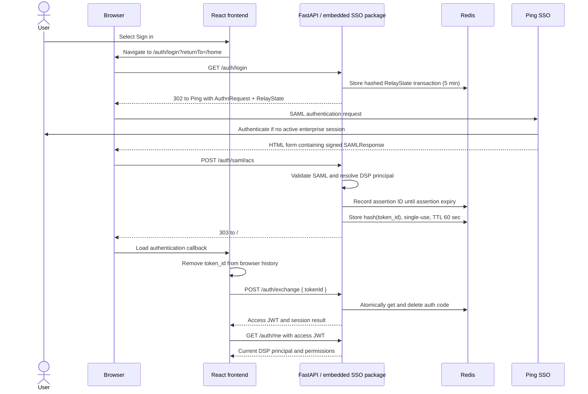

# DSP Portal Ping SSO Integration — Architecture and Delivery Plan

| Field | Value |
| --- | --- |
| Status | Proposed — ready for architecture and security review |
| Owner | DSP Platform |
| Scope | Phase 1: SP-initiated Ping SAML SSO for the DSP Portal |
| Last updated | 2026-08-26 |

## 1. Purpose and scope

This document defines the target authentication design for the React frontend and FastAPI backend. It also defines how the implementation will remain reusable while initially living inside the existing DSP repositories.

Phase 1 will provide:

- enterprise authentication through Ping SSO using SAML 2.0;
- a 60-second, single-use browser exchange code (`token_id`);
- short-lived JWT access tokens for DSP APIs;
- backend-enforced user and platform-admin authorization;
- an embedded authentication package that can be extracted for other teams later.

This design does not make the frontend a SAML service provider. The FastAPI backend is the SAML service provider and the only component that accepts or validates a SAML assertion.

## 2. Final architecture decisions

1. The user selects **Sign in** in React. The browser navigates to `GET /auth/login`; this is a top-level redirect, not an AJAX request.
2. The backend creates a SAML authentication request, stores a login transaction in Redis, and redirects the browser to Ping SSO.
3. Ping authenticates the user and posts the signed `SAMLResponse` to the backend assertion consumer service (ACS).
4. The backend fully validates the response before resolving the DSP user, LDAP groups, teams and roles.
5. The raw SAML response is discarded after validation. It is never returned to React or retained as session state.
6. The backend creates a cryptographically random `token_id`. Only its SHA-256 hash is stored in Redis, with a 60-second TTL and atomic, single-use consumption.
7. The backend redirects the browser to the frontend callback with the opaque `token_id`.
8. React removes `token_id` from the browser URL immediately and exchanges it with the backend for an application session.
9. Access JWTs are short-lived and held in frontend memory only. They are not stored in `localStorage` or `sessionStorage`.
10. Every protected API performs backend authorization. Showing or hiding navigation in React is not a security control.
11. Redis is required in production so the flow is safe across multiple backend instances. In-memory state is permitted only for local development.
12. The reusable SSO implementation remains in the backend and frontend repositories for now. Its dependency boundaries must allow later extraction without rewriting DSP business logic.

## 3. Authentication sequence



The preferred deployment uses one public origin with ingress routing:

- `/` to React;
- `/api/*` to the DSP API;
- `/auth/*` to the authentication endpoints.

This reduces CORS and cookie complexity. Separate origins may be supported, but must use an exact origin allow-list and an explicitly reviewed cookie policy.

## 4. Trust boundaries and responsibilities

| Component | Owns | Must not own |
| --- | --- | --- |
| Ping SSO | Credential entry, enterprise authentication, signed SAML assertion | DSP resource authorization |
| Embedded SSO package | SAML protocol, validation, login/replay/code/session state, generic identity and token lifecycle | LDAP-to-team or DSP-resource decisions |
| DSP backend adapters | DSP principal resolution, LDAP groups, teams, roles and resource authorization | Credential collection or SAML parsing |
| React auth module | Redirect, callback exchange, in-memory access token and auth state | SAML assertions or security decisions |
| React DSP integration | User/admin presentation and protected navigation | Authoritative authorization |
| Redis | Expiring login, replay, exchange-code and session records | Long-term identity or business data |
| PostgreSQL | DSP users, teams, LDAP mappings, roles and managed-resource relationships | Raw SAML assertions or credentials |

## 5. Embedded reusable module design

### 5.1 Backend

The generic package will be a top-level Python package, separate from the DSP application package:

```text
dsp-portal-backend/
├── enterprise_ping_sso/
│   ├── config.py
│   ├── models.py
│   ├── exceptions.py
│   ├── saml/
│   │   ├── request.py
│   │   ├── validator.py
│   │   └── metadata.py
│   ├── state/
│   │   ├── protocol.py
│   │   ├── memory.py
│   │   └── redis.py
│   ├── tokens/
│   │   ├── protocol.py
│   │   └── jwt.py
│   ├── fastapi/
│   │   ├── router.py
│   │   ├── dependencies.py
│   │   └── middleware.py
│   └── audit/
│       ├── protocol.py
│       └── logging.py
└── app/
    └── auth/
        ├── principal_resolver.py
        ├── authorization.py
        └── audit_adapter.py
```

The dependency direction is strictly:

```text
app  ───────►  enterprise_ping_sso
DSP adapters    generic authentication package
```

`enterprise_ping_sso` MUST NOT import `app` or refer to DSP roles, teams, Hive tables, YARN queues, VMs, devspaces or jobs.

The generic package owns:

- SAML request creation, response validation and metadata handling;
- login transaction, replay, exchange-code and session stores;
- a generic authenticated identity contract;
- access-token/session creation and validation;
- generic FastAPI routes and authentication dependencies;
- security audit events without DSP-specific policy.

The DSP application owns:

- mapping Ping attributes to the canonical DSP user;
- LDAP group and team relationships;
- platform-user and platform-admin roles;
- access filtering for Hive metadata, ingestion status, YARN queues, VMs, devspaces and jobs;
- DSP-specific audit context and API authorization.

### 5.2 Generic identity contract

The SSO boundary produces a generic identity similar to:

```text
AuthenticatedIdentity
├── issuer
├── subject
├── enterprise_user_id (optional)
├── display_name (optional)
├── email (optional)
├── attributes: map<string, list<string>>
├── authentication_time
├── authentication_context (optional)
└── assertion_id
```

The DSP `PrincipalResolver` converts this into the application-specific `CurrentDspPrincipal`. A stable, non-email enterprise identifier should be used as the durable subject when Ping can supply one.

### 5.3 Frontend

```text
dsp-portal-frontend/src/auth/
├── ping-sso/
│   ├── AuthProvider.tsx
│   ├── AuthCallback.tsx
│   ├── auth-api.ts
│   ├── token-store.ts
│   ├── types.ts
│   └── index.ts
└── dsp/
    ├── DspProtectedRoute.tsx
    ├── DspAuthorization.ts
    └── DspUserControl.tsx
```

The `ping-sso` module MUST NOT import DSP roles or components. The DSP layer consumes its generic session API and maps permissions to the portal experience.

## 6. Runtime state

Keys below are illustrative. All public secrets are hashed before being used as Redis keys.

| Record | TTL | Contents | Security behavior |
| --- | --- | --- | --- |
| `saml:login:{sha256(relay_state)}` | 5 minutes | SAML request ID, safe return path, created/expires times | Consumed by ACS; return path must be local and allow-listed |
| `saml:replay:{sha256(assertion_id)}` | Until SAML `NotOnOrAfter` | Replay marker | Atomic create-if-absent; a duplicate assertion is rejected |
| `auth:code:{sha256(token_id)}` | **60 seconds** | Principal ID, auth time, return path, role/version reference | Retrieved and deleted atomically; never reusable |
| `auth:session:{sha256(session_id)}` | Enterprise session policy | Principal ID, auth time, issued/expires/revoked times | Required if refresh or immediate revocation is enabled |

Production uses Redis with TLS and authenticated access. No sticky session is required. The in-memory adapter is explicitly development-only and the service must refuse production startup when it is selected.

## 7. HTTP endpoint contract

### `GET /auth/login?returnTo=/home`

- Creates the SAML request and login transaction.
- Accepts only a local, allow-listed return path; arbitrary URLs are rejected.
- Returns a `302` redirect to Ping SSO.

### `POST /auth/saml/acs`

- Accepts Ping's form-encoded `SAMLResponse` and `RelayState`.
- Applies strict body-size limits and SAML validation.
- Resolves/provisions the DSP principal according to approved policy.
- Creates the 60-second exchange code.
- Returns a `303` redirect to the configured frontend callback.
- Does not expose the SAML response to the frontend.

### `POST /auth/exchange`

Request:

```json
{"tokenId": "opaque-one-time-value"}
```

- Atomically consumes the exchange-code record.
- Returns a generic `invalid_or_expired_code` for an absent, expired or reused code.
- Creates the application access token and, if selected, the refresh session.

### `GET /auth/me`

- Requires a valid access token.
- Returns the current DSP user, team, roles and frontend-relevant permissions.
- Does not return raw SAML attributes unless explicitly approved for the UI contract.

### `POST /auth/refresh`

- Rotates the access token using the approved refresh/session mechanism.
- Rejects revoked or expired sessions.

### `POST /auth/logout`

- Revokes the DSP session and clears any session cookie.
- A later phase may add Ping single logout after enterprise validation; local logout is mandatory for Phase 1.

If other services must validate DSP access tokens directly, a JWKS endpoint may be added. It is not required while all protected requests terminate at the DSP backend.

## 8. Mandatory SAML validation

The ACS must reject a response unless all applicable checks pass:

- secure XML parsing with external entities and unsafe expansion disabled;
- maximum request and decoded-assertion sizes;
- response/assertion signature according to the agreed Ping profile;
- signing certificate anchored to trusted Ping metadata;
- expected issuer;
- exact SP audience/entity ID;
- exact destination and subject-confirmation recipient;
- `InResponseTo` matched to the stored login transaction;
- `NotBefore` and `NotOnOrAfter`, with a small configured clock skew;
- acceptable authentication context when required by policy;
- unpredictable, matching and unexpired `RelayState`;
- assertion-ID replay prevention;
- required subject and identity attributes;
- encrypted assertion handling if mandated by Ping/security.

Servers must use synchronized enterprise time. Validation failures produce a generic user-facing error and a reason-coded security event; tokens, assertions, credentials and complete sensitive attributes must never be logged.

## 9. JWT and session policy

Phase 1 defaults:

| Setting | Default |
| --- | --- |
| Exchange-code lifetime | 60 seconds |
| Access-JWT lifetime | 10 minutes |
| Signing | Asymmetric enterprise-approved algorithm |
| Browser access-token storage | Memory only |
| Refresh/session lifetime | To be confirmed with enterprise security; maximum 8 hours proposed |

JWT claims should be minimal:

- `iss`, `aud`, `sub`, `sid`, `jti`;
- `iat`, `nbf`, `exp`;
- approved coarse-grained roles or a permission-version reference.

JWTs must not contain the SAML assertion, credentials, secrets, excessive LDAP membership or unnecessary personal data. Signing keys are loaded from CyberArk or the approved enterprise key-management mechanism, use a `kid`, and have a documented overlap/rotation procedure.

The initial token is DSP application-specific. If the enterprise later requires one token trusted by multiple applications, issuance should move to an approved central authorization server; individual applications should not independently become enterprise-wide token issuers.

## 10. Authorization model

Authentication establishes identity. DSP authorization is evaluated independently against PostgreSQL-backed DSP relationships and approved enterprise group claims.

Backend dependencies will include equivalents of:

- `require_authenticated_user`;
- `require_platform_admin`;
- `require_resource_access(resource_type, resource_id)`.

Expected policies include:

| Area | Minimum backend policy |
| --- | --- |
| User homepage/activity | Current authenticated principal |
| Hive table metadata and ingestion status | Tables granted through the principal's LDAP group/team; no Hive row data is exposed |
| YARN queue status | Queues associated with the principal's team |
| Devspaces/jobs/VMs | Explicit user/team/resource relationship |
| Platform administration | Platform-admin role/group on every admin API |
| Support content | Authenticated user, with mutation restricted to approved admin/support roles |

The React application may hide inaccessible routes and actions for usability, but a direct API call must still receive `403 Forbidden`. The dummy user must be removed once SSO is enabled, and portal/admin data must not load before authentication completes.

Production builds must set `VITE_ENABLE_PREVIEW_DATA=false`. If an API is unavailable, the UI shows an unavailable/stale state rather than silently displaying bundled example data.

## 11. Configuration and secrets

Recommended non-secret environment variables:

```text
DSP_AUTH_ENABLED=true
DSP_FRONTEND_BASE_URL=https://dsp.example.enterprise
DSP_SAML_SP_ENTITY_ID=<registered-sp-entity-id>
DSP_SAML_ACS_URL=https://dsp.example.enterprise/auth/saml/acs
DSP_SAML_IDP_METADATA_URL=<approved-ping-metadata-url>
DSP_SAML_EXPECTED_ISSUER=<approved-ping-issuer>
DSP_SAML_CLOCK_SKEW_SECONDS=120
DSP_REDIS_URL=<redis-endpoint-or-secret-reference>
DSP_AUTH_CODE_TTL_SECONDS=60
DSP_JWT_ISSUER=<dsp-token-issuer>
DSP_JWT_AUDIENCE=<dsp-api-audience>
DSP_JWT_ACCESS_TTL_SECONDS=600
DSP_SESSION_TTL_SECONDS=<approved-value>
DSP_PLATFORM_ADMIN_GROUPS=<approved-group-identifiers>
```

The following are secrets and must be injected at runtime from CyberArk or the approved secret manager, never committed, placed in `.env` examples, passed as Docker build arguments or baked into an image:

- SP private key, if assertion decryption or request signing is required;
- SP certificate where applicable;
- JWT signing private key;
- Redis credentials;
- any metadata trust material not delivered through an approved trust bundle.

Configuration must be validated at startup and fail closed when authentication is enabled but required values are missing.

## 12. Docker and build packaging

The SSO code can be packaged in the current backend image without a separate repository or image. The build must install both Python package trees:

```toml
[tool.setuptools.packages.find]
include = ["app*", "enterprise_ping_sso*"]
```

The image build should:

1. build/install the project as a wheel in a multi-stage build;
2. use the approved Debian/slim enterprise base if the chosen SAML implementation requires `libxml2`/`xmlsec` native packages;
3. copy source and declared package data, but no keys or local secret files;
4. run import smoke tests for both `app` and `enterprise_ping_sso`;
5. run as a non-root user with a read-only filesystem where the platform permits it.

Alpine should not be selected until the SAML/XML cryptography stack has been proven and approved there. Redis is a separate managed service/deployment; it is not embedded in the API container.

Minimum CI smoke checks:

```bash
python -c "import enterprise_ping_sso"
python -c "from app.main import app"
```

If the library includes XML schemas, templates or metadata resources, they must be declared as package data and verified from the built wheel, not only from the source checkout.

## 13. Failure behavior

| Condition | Result |
| --- | --- |
| Ping unavailable | Sign-in unavailable page with correlation ID and support path |
| Invalid/expired/replayed SAML | Authentication rejected; no exchange code created |
| Unknown/unapproved user | Authenticated identity is not granted DSP access; auditable access-denied result |
| Expired/reused `token_id` | Generic invalid/expired callback with a restart-sign-in action |
| Redis unavailable | Fail closed; readiness becomes unhealthy; no local production fallback |
| PostgreSQL/principal mapping unavailable | Fail closed before a DSP session is issued |
| Signing key unavailable | Fail closed and remove instance from readiness |
| JWT expired | `401`, followed by approved refresh or a new login |
| Authenticated but unauthorized | `403`; do not redirect repeatedly to Ping |

Authentication errors must not reveal whether a user, group, assertion or session exists.

## 14. Observability and operational controls

The implementation must provide:

- correlation IDs across login, ACS, exchange and application requests;
- structured audit events for login success/failure, replay detection, exchange expiry/reuse, refresh, logout and authorization denial;
- metrics for authentication latency, success/failure reasons, expired exchange codes, replay attempts and API `401`/`403` rates;
- liveness and dependency-aware readiness checks;
- dashboards and alerts for Ping, Redis, principal resolution and signing-key failures;
- certificate, metadata and JWT-key rotation runbooks;
- TLS, HSTS, CSP, anti-clickjacking, content-type and referrer-policy headers;
- log redaction tests covering SAML, tokens, cookies and sensitive attributes.

Metrics and logs must avoid secrets and unnecessary personally identifiable information. Audit identity should use the approved stable identifier or an irreversible operational representation.

## 15. Test strategy

### Backend automated tests

- valid SP-initiated login and callback;
- invalid signature/certificate, issuer, audience, destination and recipient;
- expired/not-yet-valid assertion and bounded clock skew;
- missing/mismatched `InResponseTo` and RelayState;
- open-redirect attempts;
- assertion replay and concurrent replay attempts;
- 60-second exchange expiry, reuse and concurrent exchange;
- JWT signature, issuer, audience, lifetime and key rotation;
- logout/revocation and refresh rotation;
- user resource filtering and platform-admin `403` cases;
- XML entity/expansion attacks and oversized request bodies;
- multi-instance behavior through shared Redis;
- proof that logs do not contain assertions, codes, JWTs or secrets.

### Frontend automated tests

- sign-in performs a browser redirect;
- callback exchanges the code and removes it from browser history immediately;
- access token remains in memory and is absent from web storage;
- protected routes wait for authentication;
- refresh, expiry and logout behavior;
- admin navigation visibility and server-side `403` handling;
- production build contains no enabled preview-data fallback;
- `401`, `403`, Ping failure and backend-unavailable states.

### Integration and security tests

- non-production Ping metadata, claim mapping and certificate rotation;
- login with and without an existing Ping session;
- logout behavior agreed with Ping/security;
- penetration testing of SAML, redirect, session, CSRF and token handling;
- load and resilience testing with multiple backend instances and Redis failover.

## 16. Delivery plan

### Stage 1 — Contracts and enterprise registration

- Approve this design and capture the final decisions as an ADR.
- Confirm Ping SAML claim contract, signature/encryption profile, metadata and certificate-rotation process.
- Register development, test and production SP entity IDs, ACS URLs and logout behavior.
- Approve DSP role/group mapping and session lifetime.

### Stage 2 — Backend authentication foundation

- Add the embedded `enterprise_ping_sso` package and its protocol interfaces.
- Implement Redis and development-only in-memory stores.
- Implement SAML routes/validation, replay protection and 60-second exchange.
- Implement asymmetric JWT/session support and negative security tests.

### Stage 3 — DSP identity and authorization

- Implement DSP principal resolution from the stable enterprise identity.
- Connect LDAP groups, teams and platform roles to the existing data model.
- Apply backend authorization to every user and admin endpoint.
- Add audit adapters and resource-scope tests.

### Stage 4 — Frontend integration

- Add the reusable React auth module and callback.
- Replace the dummy user with `/auth/me` data.
- Add protected routes, role-aware navigation and explicit error states.
- Disable production preview data and ensure no application data loads before authentication.

### Stage 5 — Non-production validation

- Deploy behind same-origin ingress with Redis and runtime secrets.
- Complete Ping integration, security testing, failure exercises and operational dashboards.
- Validate image packaging and horizontal scaling.

### Stage 6 — Controlled rollout

- Pilot with DSP platform/admin users.
- Expand to a small number of representative teams.
- Roll out to all DSP users after acceptance gates and support runbooks are complete.

### Stage 7 — Optional extraction

Do not create new authentication repositories in Phase 1. Extract only when a second consuming team has a concrete use case and the interfaces have stabilized. Extraction will move the generic folders into versioned Python and npm packages published through the approved Nexus repositories; DSP adapters remain in DSP.

## 17. Acceptance gates

The release is not ready until all of the following are true:

- Ping is the only component that receives enterprise credentials.
- React never receives or parses a SAML assertion.
- Raw assertions are discarded after validation and absent from logs/state.
- `token_id` is random, hash-stored, single-use and expires after 60 seconds.
- SAML login, assertion replay and code exchange work across backend replicas through Redis.
- Access JWTs are short-lived, asymmetrically signed and support key rotation.
- Every protected API authenticates and authorizes on the backend.
- Every platform-admin API rejects a normal DSP user.
- Production preview/fallback data is disabled.
- Negative SAML, replay, expiry, concurrency, authorization and logout tests pass.
- The built Docker image can import both application and embedded SSO packages.
- Images, configuration, telemetry and source contain no credentials, private keys, assertions or tokens.
- Security, Ping IAM and DSP architecture owners approve the production configuration.

## 18. Decisions required during review

1. Is Ping OIDC available and approved for this application? This plan implements the requested SAML flow; OIDC would reduce application-owned SAML complexity if enterprise Ping supports it.
2. Which Ping claim is the immutable enterprise user identifier? Email should not be assumed stable.
3. Are responses, assertions or both signed, and is assertion encryption mandatory?
4. What authentication context/MFA policy must DSP require?
5. Which LDAP group(s) grant DSP access and which grant platform-admin access?
6. Is DSP just-in-time user creation allowed, or must the user already exist in PostgreSQL?
7. Is a 10-minute access token and an up-to-8-hour refresh session acceptable?
8. Is local DSP logout sufficient for Phase 1, or is Ping single logout mandatory?
9. Will JWTs remain DSP-specific, or must downstream services validate them?
10. What are the final development, test and production entity IDs, origins and ACS URLs?
11. How will Ping metadata/signing certificate and DSP JWT keys be rotated and tested?

## 19. Extraction readiness criteria

The embedded code is ready to become a shared library when:

- at least one additional team has a committed integration;
- DSP-specific imports are absent from the generic package;
- configuration, identity resolution, persistence, audit and token issuance are exposed through documented interfaces;
- framework-facing APIs are versioned and have compatibility tests;
- a built-wheel test proves Python resources and native dependencies are complete;
- the React package exposes a stable provider/callback/session contract;
- ownership, security patching, release versioning and support are agreed;
- packages can be published and consumed from the approved Nexus repositories.

Until those criteria are met, keeping the module embedded avoids premature repository and release-management overhead while preserving a clean extraction path.
