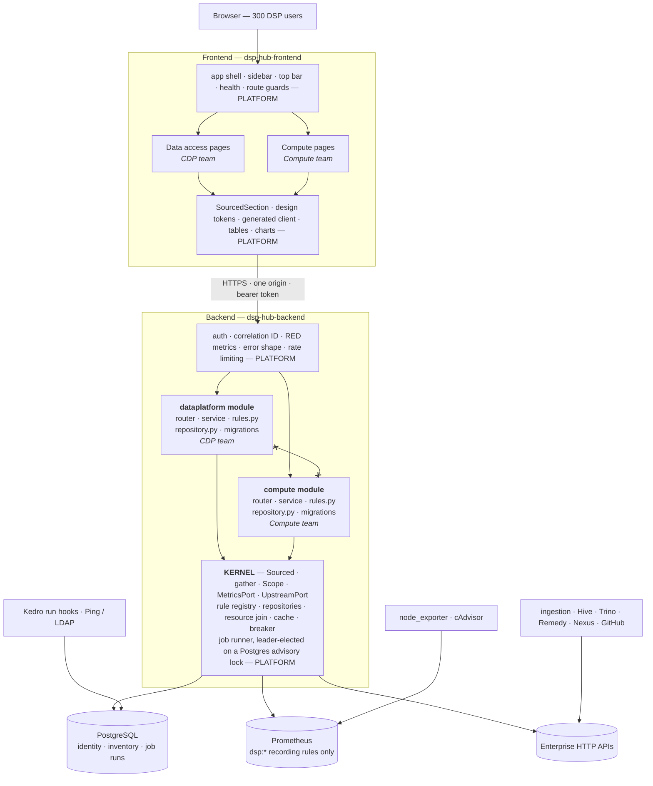

# DSP Portal — platform

| Field | Value |
| --- | --- |
| Status | Draft for review |
| Scope | What the platform provides to module teams, backend and frontend |
| Audience | Anyone building or reviewing a DSP Portal module |
| Last updated | 2026-09-07 |

## 1. The rule

> If four teams would each have to decide it, and the four answers being different would hurt,
> the platform decides it once.

Not about reuse — duplicated code is often fine. It is about decisions where divergence surfaces
later as an incident, an audit finding, or a screen that behaves unlike the one next to it. How a
slow upstream degrades. What an error looks like. Whether a background job runs once or four times.
Whether a user can see another team's rows.

## 2. End to end



Read it vertically and the two teams are identical: a page, a router, a service, rules, a
repository. Read it horizontally and they never touch. **The absence of an edge between the two
module boxes is the load-bearing feature, not an omission.**

## 3. Sourced — the one type everyone imports

Every read from any store is wrapped. This is small and it is the highest-leverage type in the
codebase: it turns "remember to think about staleness" into something the type system asks about.

```python
# app/platform/sourced.py
Source = Literal["live", "cached", "unavailable"]

@dataclass(frozen=True, slots=True)
class Sourced(Generic[T]):
    value: T | None
    source: Source
    as_of: datetime | None = None
    detail: str | None = None     # reason code when unavailable, never an exception string

    @property
    def ok(self) -> bool: ...
    def map(self, fn: Callable[[T], U]) -> Sourced[U]: ...   # provenance survives transformation
```

Consequences:

- The per-section `asOf` and `source` fields the homepage requires become **structural rather than
  remembered** — the response model is built from the envelope.
- Degradation is uniform: one helper turns a partial read into a partial response.
- A slow upstream produces a stale page, never a blank one.

Composing a screen:

```python
sections = await gather(
    timedelta(milliseconds=1500),
    inventory=self.repo.vms(scope),           # PostgreSQL
    cpu=self.metrics.latest(rules.VM_CPU),    # Prometheus
    ingestion=self.upstream.get(SCHEDULER),   # HTTP
)
```

Anything that misses the deadline or raises becomes `Sourced.unavailable`. The page still renders.

## 4. Three ports

Deliberately not one abstraction. The stores differ in exactly the properties an abstraction hides.

| | PostgreSQL | Prometheus | Enterprise HTTP |
| --- | --- | --- | --- |
| Ownership | Ours | Someone else's metric names | Someone else's contract |
| Consistency | Transactional | Sampled, sometimes missing | Varies |
| History | Until we delete it | Gone at retention | None |
| Cost of one call | Sub-millisecond | Hundreds of ms, shared | Hundreds of ms |
| Cost of N in a loop | Slow | An outage for other teams | A rate-limit ban |

Hide that behind one `query()` and someone writes `for vm in vms: source.query(...)`, because it
reads exactly like the Postgres call above it. The abstraction does not prevent the mistake; it
makes the mistake look reasonable.

### 4.1 MetricsPort

```python
class MetricsPort(Protocol):
    async def latest(rule: MetricRule, *, match=None) -> Sourced[MetricSet]
    async def series(rule: MetricRule, *, window, step, match=None) -> Sourced[SeriesSet]
    async def latest_many(*rules, match=None) -> dict[str, Sourced[MetricSet]]
    async def health() -> Sourced[None]
```

What happens behind one `latest()` call, none of which a module writes:

1. Resolves the rule name — no PromQL leaves a module
2. TTL cache check; a hit returns `Sourced.cached` with the original timestamp
3. **Single-flight** — 50 concurrent callers issue one HTTP request
4. Takes its slice of the request's remaining timeout budget
5. Circuit breaker — fails fast when Prometheus is failing
6. Pooled `httpx` client, platform TLS and auth
7. OTel span tagged with the rule name
8. Validates the Prometheus response envelope, not just the HTTP status
9. Types the samples with the rule's declared `Unit`
10. `as_of` from the sample's own timestamp, **not** `now()`
11. Wraps in `Sourced`; **never raises into module code**
12. Records outcome to the portal's own metrics
13. Writes through to cache

### 4.2 The rule registry

Teams do not write PromQL. They declare rules, and the registry generates the Prometheus config.

```python
# app/modules/compute/rules.py — owned by the compute team, no shared file to edit
VM_CPU = register(MetricRule(
    name="dsp:vm_cpu_utilisation:ratio",
    expr='1 - avg by (instance) (rate(node_cpu_seconds_total{mode="idle",job="dsp-node"}[5m]))',
    labels=("instance",),
    unit=Unit.RATIO,
    owner="compute",
))
```

One object, four jobs: it generates `prometheus/dsp_rules.yml`; CI proves every rule returns data
against the real Prometheus; names and labels are typed, so a typo is an import error rather than
an empty chart; and "what does the portal need from monitoring?" has a file for an answer.

It also prevents the failures you only get once — unbounded queries (aggregation happens in the
recording rule, evaluated on an interval, not per page load) and cardinality growth (declared
labels are the reviewed set; a run id cannot quietly become a label).

**Adding a metric:** add the rule → `make rules` regenerates the YAML → the PR carries both, and
monitoring reviews the recording rule → CI asserts it returns data once deployed.

### 4.3 Making the batch call the natural one

```python
# Right — one HTTP call, every VM, indexed by label
cpu = await metrics.latest(rules.VM_CPU)
for vm in vms:
    util = cpu.value.by("instance").get(vm.scrape_target)

# Wrong — and it now looks wrong, which is the point
for vm in vms:
    cpu = await metrics.latest(rules.VM_CPU, match={"instance": vm.scrape_target})
```

### 4.4 Repository and Scope

Route-level authorization answers "may this person call this endpoint". Every screen also needs
"which rows may they see", and that must not be four teams' problem.

```python
def devspaces(self, scope: Scope) -> list[Devspace]:
    return self.session.scalars(scope.apply(select(Devspace), Devspace)).all()
```

Scoping is a parameter, not a convention. The **unscoped** read is the one that needs a name —
`devspaces_unscoped()`, greppable, reviewed, rare. A platform test asserts that every repository
method returning an owned model takes a `Scope`.

### 4.5 UpstreamPort

The CDP team's biggest dependencies — the ingestion scheduler, Hive, Trino — are neither PostgreSQL
nor Prometheus. Left unowned, each module reaches for its own client, timeout and idea of failure.
`UpstreamPort` wraps any external HTTP dependency and returns the same envelope with the same
budget, breaker, cache and tracing. Remedy, Confluence, Nexus and GitHub arrive later through the
same door.

### 4.6 The resource join

`ResourceMetrics.attach(resources, rule)` joins inventory rows to Prometheus series through
`resource_metric_identity`. Written once, because getting it subtly wrong shows one VM's memory
under another VM's name. A resource with no live series returns `Sourced.unavailable` rather than
zero — which keeps "switched off" distinguishable from "we stopped looking".

## 5. Module boundaries

A modular monolith. At this size, network boundaries between four teams buy nothing a lint rule
does not.

```text
app/
  platform/              # the kernel. Changes need architecture review.
    sourced.py           #   Sourced, gather
    authz.py             #   Scope
    metrics/             #   MetricRule, registry, MetricsPort, client, cache, join
    upstream/            #   UpstreamPort
    db/                  #   session lifecycle, repository conventions
    jobs/                #   leader-elected job runner
    events/              #   in-process domain events
    testing/             #   FakeMetrics, database fixtures
  modules/
    dataplatform/        # rules.py service.py repository.py router.py migrations/
    compute/
    support/
    onboarding/
```

Enforced in CI, not documented in a wiki:

```ini
# setup.cfg
[importlinter:contract:module-independence]
name = Modules do not import each other
type = independence
modules =
    app.modules.dataplatform
    app.modules.compute
    app.modules.support
    app.modules.onboarding

[importlinter:contract:kernel-purity]
name = The kernel knows nothing about modules
type = forbidden
source_modules = app.platform
forbidden_modules = app.modules
```

The second contract matters more. A kernel that imports a module has stopped being a kernel, and it
happens gradually — one reasonable convenience helper at a time.

### How the two teams actually interact

| Situation | What happens |
| --- | --- |
| Compute needs a metric CDP defined | Import the rule. Rules are global by name; `owner` says who to ask |
| CDP needs a devspace name on a job row | Both read `resource`, a kernel table. Shared inventory is a platform concern precisely because two modules need it |
| Compute wants to react to something CDP did | A domain event. Neither imports the other. Build it when the first real case appears |
| Both need the same helper | Promotion rule — a second module makes it kernel, reviewed |
| A team needs a kernel change | The kernel owner, with a committed turnaround. This interaction decides whether the platform is used or routed around |
| Anything else | They do not interact. That is the design working, not a coordination failure |

## 6. Background work

The reconciler, directory sync, Kedro ingest, cache warming and retention cleanup are periodic
work. The moment the API runs more than one replica, a naive scheduler runs every job on every
replica.

Leader election through `pg_try_advisory_lock` — no new infrastructure, and the lock dies with the
connection, so a crashed leader releases it with no timeout to tune. Jobs stay idempotent anyway:
leader election reduces duplicate runs, it does not eliminate them.

Each job is declared by its owning module, run by the kernel, and emits its own duration and
outcome metrics.

## 7. Frontend platform

`Sourced` has an exact counterpart. Building them as a pair is what makes provenance visible rather
than merely available.

```tsx
<SourcedSection data={vms} title="VM fleet">
  {(value) => <VmTable rows={value} />}
</SourcedSection>
// skeleton while loading · "as of 14:32" badge when cached · unavailable panel with retry
```

Also platform-owned: design tokens, the shell contract for registering a page and sidebar entry,
the generated API client, and shared table, chart and empty-state components.

## 8. Testing

The kernel ships the fakes. If each team writes its own Prometheus stub, four subtly different
behaviours emerge and none of them models a timeout.

```python
metrics = (FakeMetrics()
    .given(rules.VM_CPU, {"dsp-vm-01:9100": 0.42})
    .unavailable(rules.VM_DISK)
    .slow(rules.VM_MEM, timedelta(seconds=5)))
```

| Store | In tests | Why not the obvious alternative |
| --- | --- | --- |
| Prometheus | `FakeMetrics` | A real Prometheus tests their code, not ours, and cannot be made to time out on demand |
| PostgreSQL | Real Postgres, transaction rolled back per test | SQLite lacks `INET`, `CIDR`, `JSONB`, partial indexes and `num_nonnulls` — the schema uses all five |

**One test every module inherits:** every screen renders with each of its sections unavailable in
turn. Parametrised over the module's sections, close to free, and the test that would have caught
most status-page outages in the wild.

## 9. Libraries

Build what is ours; take the rest. Not air-gapped, so there is no reason to hand-write a retry loop.

### Build — roughly 1,000 lines, two weeks

`Sourced`, `gather`, `Scope`, the rule registry and YAML export, the Prometheus query client, the
resource join, the circuit breaker, the TTL cache with single-flight, the job runner, the RFC 9457
error handler, the correlation-ID middleware, the event dispatcher.

### Take, wrapped — because modules would otherwise diverge

| Library | Why wrapped | Modules import |
| --- | --- | --- |
| `httpx` | One timeout budget, breaker, tracing, envelope | `MetricsPort`, `UpstreamPort` |
| `structlog` | Redaction processors must be guaranteed | `platform.logging.get_logger()` |
| `tenacity` | Retry policy is a platform decision | nothing — inside the ports |
| `cachetools` | One TTL, so two teams cannot cache differently | nothing — inside the client |
| `@tanstack/react-query` | Its states map onto `Sourced`, once | `<SourcedSection>` |
| `@radix-ui/*` | Otherwise four teams style four dialogs | platform components |
| charts | Every sparkline should look identical | `<Sparkline>`, `<TimeSeries>` |
| `date-fns` | "2h ago" must render the same everywhere | `platform.time.*` |

### Take, imported directly — wrapping is ceremony

`react-router`, `lucide-react`, `cva`, SQLAlchemy, Alembic, pydantic, polyfactory, testcontainers,
import-linter. **OpenTelemetry** belongs here too: instrumentation is applied once at startup and
modules never call it.

The test is whether a module would otherwise make a decision the platform should own. `date-fns`
passes it; `lucide-react` does not.

### Declined

| Declined | Why |
| --- | --- |
| Celery, or any broker-backed queue | Brings Redis or RabbitMQ for five periodic jobs |
| A DI framework | FastAPI's `Depends` is the container. A second means two ways to wire everything |
| A wrapper over SQLAlchemy | It is already the abstraction. Wrapping hides the query plans you need when a page is slow |
| GraphQL | Read models are composed server-side per screen — the problem GraphQL solves |
| Material, Ant, Chakra | The brief asks for a calm, dense enterprise surface. Opinionated kits get fought rather than used |
| A state-management library | Server state belongs to the query library; client state here is small |

## 10. Build order

Ordered by teams unblocked, not by interest.

| # | Item | Size |
| --- | --- | --- |
| 1 | One-command local stack — compose with Postgres, Prometheus, fake IdP, seed data | 2d |
| 2 | Scoping helpers and the repository test | 3d |
| 3 | The data-access kernel — Sourced, gather, registry, client, join, fakes | 1w |
| 4 | UI platform and generated client; delete the hand-written type files the same day | 1w |
| 5 | Observability middleware — correlation ID, RED metrics, redaction test | 3d |
| 6 | Module template and CI gates | 3d |
| 7 | Background job runner | 4d |
| 8 | Contracts written down as short ADRs | 2d |
| 9 | Domain event bus — deliberately last, when two modules actually need it | defer |

Four to five weeks. **Items 1 to 4 must precede module work**; the rest can land while the first
module is written, provided that team knows what is coming.

## 11. Contracts to settle before anyone writes a module

Hours to decide, weeks to retrofit across four modules.

| Contract | The decision |
| --- | --- |
| Error responses | One body shape for every 4xx and 5xx — machine-readable code, human message, correlation ID. RFC 9457 |
| Pagination | Cursor, not offset, on anything that can grow. Retrofitting is a breaking change |
| API versioning | Additive only within `v1`. A new field is never breaking; a removed or retyped one always is |
| Migrations | Expand then contract. A module owns its tables; shared tables need review; cross-module foreign keys are a smell |
| Data classification | Mark fields personal, cacheable, loggable at the model, so the cache and log formatter enforce it |
| Cross-module communication | In-process domain events plus published read models. No sideways imports |

## 12. Governance

**A named kernel owner and a promotion rule.** Something enters the kernel when a *second* module
needs it, reviewed — not on the strength of a third being likely. A platform that grows by
prediction accumulates abstractions nobody uses, and those are harder to remove than to have never
written.

**An escape hatch that is real.** `raw_query(promql)` and `*_unscoped()` exist, are greppable, and
need a named reviewer. Paved road, not a fence.

**A response commitment.** The kernel owner commits to a turnaround on module requests. A platform
nobody can get changes into is worse than no platform: teams work around it, and then there are
four private forks of the shared layer and none of the benefits.

**A stated SLO.** For example: the homepage returns under a second at p95, available 99.5% of the
month. Without a number there is no principled way to choose between shipping the next feature and
fixing the slow one — and that choice gets made every sprint regardless.

## 13. What a team does on day one

1. Create `app/modules/<name>/` with `rules.py`, `repository.py`, `service.py`, `router.py`,
   `migrations/`. Nothing else in the tree changes.
2. Declare the metrics you need in `rules.py`. CI generates the recording rules and proves each
   returns data. No shared file, so no merge conflict with another team.
3. Write repository methods for what you own. Every one taking a `Scope`.
4. Assemble the screen in `service.py` with `gather()` and a deadline.
5. Register the router. Authentication and authorization are already applied.
6. Parametrise the inherited degradation test over your sections.
